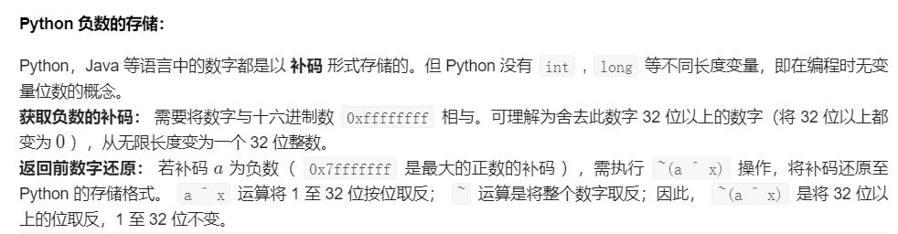
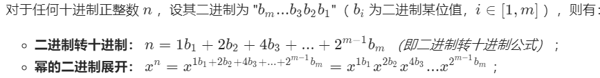

[位运算总结](http://graphics.stanford.edu/~seander/bithacks.html#OperationCounting)

# 常识

**加法非进位**

n=a^b

**加法进位**

c=a&b

**加法**

a+b=n+c=sum

n+c可以进一步递归，直到c为0时，返回n

## 基本操作

a=0^a = a^0

0=a ^ a

由上面两个推导出：a=a^ b ^b

# 没有加减乘除的加法

python写这道题有些复杂



```python
class Solution:
    def add(self, a: int, b: int) -> int:
        x=0xffffffff
        a,b=a&x,b&x #取32位以内的二进制
        while b!=0:
            a,b=(a^b),(a&b)<<1&x
        return a if a<=0x7fffffff else ~(a^x) #若补码 aa 为负数,需要还原将32位以上取反
```

更推荐用C / C++ / JAVA

```C++
class Solution {
public:
    int add(int a, int b) {
        return b == 0 ? a : add((a ^ b),(unsigned int)(a & b) << 1);
    }
};
```

# 只出现一次的数

	给定一个非空整数数组，除了某个元素只出现一次以外，其余每个元素均出现两次。找出那个只出现了一次的元素。

说明：

你的算法应该具有线性时间复杂度。 你可以不使用额外空间来实现吗？

**示例 :**

```
输入: [2,2,1]
输出: 1
```

用的定律就好了

```python
class Solution:
    def singleNumber(self, nums: List[int]) -> int:
        result=0
        for num in nums:
            result^=num
        print(result)
        return result
```

# 其他数均重复两次，找两个出现一次的数

由于a，b第一个不同的位值

正好也能将相同的两个数放在一起异或掉

```python
class Solution:
    def singleNumbers(self, nums: List[int]) -> List[int]:
        res=0 #结果
        a=0 #a
        b=0 #b
        for num in nums:
            res=res^num #先把a^b算出来
        h=1
        while res&h==0: #找到 a和b 第一个不同的位值
            h<<=1
        for num in nums:
            if h&num==0: a=a^num #根据这位把a和b分开
            else: b=b^num
        return [a,b]
```

# 其他数均重复三次，找出一次的数

[剑指 Offer 56 - II. 数组中数字出现的次数 II](https://leetcode-cn.com/problems/shu-zu-zhong-shu-zi-chu-xian-de-ci-shu-ii-lcof/)

```python
class Solution:
    def singleNumbers(self, nums: List[int]) -> List[int]:
        res=0
        for i in range(32):
            cnt=0
            bit=1<<i
            for num in nums:
                if num&bit!=0:
                    cnt+=1
            if cnt%3!=0:
                res=res|bit
        return res - 2**32 if res>2**31-1 else res
```


# 位1的个数

[位1的个数](https://leetcode-cn.com/problems/number-of-1-bits/)

主要是不断地 `&` 操作，获得去掉末位 `1` 的n

```python
class Solution:
    def hammingWeight(self, n: int) -> int:
        res=0
        while n!=0:
            n=n&(n-1) #去除最低的1
            res+=1
        return res
```

# 比特位计数（多个数的比特位计数）

[比特位计数](https://leetcode-cn.com/problems/counting-bits/)

上一题 `位1的个数` 的组合而已

```python
class Solution:
    def countBits(self, num: int) -> List[int]:
        res=[[0] for i in range(num+1)]
        for i in range(0,num+1):
            num=i
            cnt=0
            while num!=0:
                num=num&(num-1)
                cnt+=1
            res[i]=cnt
        return res
```

# 颠倒二进制位

[190. 颠倒二进制位](https://leetcode-cn.com/problems/reverse-bits/)

通过pwd直接模拟

```python
class Solution:
    def reverseBits(self, n: int) -> int:
        pwd=31
        res=0
        while n!=0:
            res+=(n&1)<<pwd
            n>>=1
            pwd-=1
        return res
```

# 数字范围按位与

[201. 数字范围按位与](https://leetcode-cn.com/problems/bitwise-and-of-numbers-range/)

```
解题
0~4
00 & 01 & 10 & 11=00 //即只与不同的，n~m范围内的数，相同低位都会&为0
```

```python
class Solution:
    def rangeBitwiseAnd(self, m: int, n: int) -> int:
        cnt=0
        while m!=n:  
            m>>=1
            n>>=1
            cnt+=1
        return m<<cnt
```

# 快速幂迭代 DNA题

[剑指 Offer 16. 数值的整数次方](https://leetcode-cn.com/problems/shu-zhi-de-zheng-shu-ci-fang-lcof/)



```python
class Solution:
    def myPow(self, x: float, n: int) -> float:
        # 迭代 快速幂
        #if x==0: return 0
        res=1
        if n<0:
            x,n=1/x,-n
        while n:
            if n&1: res*=x
            x*=x
            n>>=1
        return res

        # # 递归 快速幂
        # if n==0: return 1
        # if n==1: return x
        # if n==-1: return 1/x
        # half=self.myPow(x,n//2)
        # mod=self.myPow(x,n%2)
        # return half*half*mod
```

