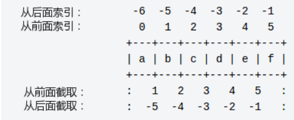
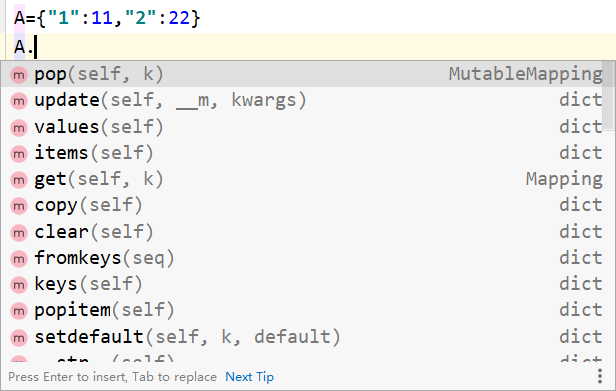
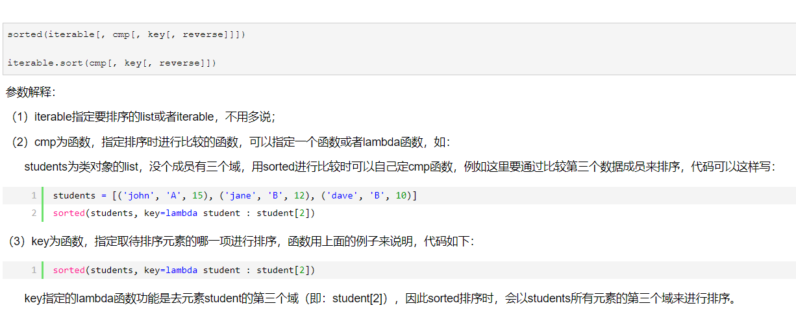

# python基础

[菜鸟教程](https://www.runoob.com/python3/python3-tutorial.html)

## 变量

Python3 的六个标准数据类型中：

- **不可变数据（3 个）：**Number（数字）、String（字符串）、Tuple（元组）；
- **可变数据：均为序列（3 个）：**List（列表）、Dictionary（字典）、Set（集合）。

python 函数的参数传递：

- **不可变类型：**类似 c++ 的值传递，如 整数、字符串、元组。如fun（a），传递的只是a的值，没有影响a对象本身。比如在 fun（a）内部修改 a 的值，只是修改另一个复制的对象，不会影响 a 本身。
- **可变类型：**类似 c++ 的引用传递，如 列表，字典。如 fun（la），则是将 la 真正的传过去，修改后fun外部的la也会受影响

### 数字

```pythono
a, b, c, d= 10,10.0,True,3+4j
print(type(a),type(b),type(c),type(d))
# <class 'int'> <class 'float'> <class 'bool'> <class 'complex'>

del(a,...)
```

[python 字符串常用操作方法](https://www.cnblogs.com/zyqy/p/9240396.html)

### 字符串

Python 没有单独的字符类型，一个字符就是长度为1的字符串。

Python 字符串不能被改变。向一个索引位置赋值，比如word[0] = 'm'会导致错误。

切片一个点是：左起点包含，终点不包含

**[  开始索引,  结束索引,  步长] ** 遵循**左闭右开**原则

```python
a="1234567891"
print(a[0]) #1
print(a[2:5]) #345
print(a[0:-3]) #1234567
print(a[-5:-1]) #6789
print(a[-2:]) #91 :代表1

字符串转列表： return eval(str) 
字符串转数字： return int(str) 
四则运算： return eval(str)
```



字符串转元组，逆转，再变回来

```python
a="baidu"
inputWords = a.split(" ") #['baidu']<---
output = ''.join(inputWords)<---

inputWords2 = list(a)<---
inputWords2=inputWords2[-1::-1] # ['u', 'd', 'i', 'a', 'b']
output2 = ''.join(inputWords2)
print(inputWords)
print(inputWords2)
```

### 列表

加号 **+** 是列表连接运算符，星号 ***** 是重复操作。

Python 列表截取可以接收第三个参数，参数作用是截取的步长

```python
a=[1,2,3]
print(a+a) #[1, 2, 3, 1, 2, 3]
print(a*4) #[1, 2, 3, 1, 2, 3, 1, 2, 3, 1, 2, 3]
print(a[::2]) #[1, 3]

判断是否为空
if list
就好，如此简单
```

位置查找

```python
a_list = ['a','b','c','hello']
print('a' in a_list) #True
print('a' not in a_list) #False
print(a_list.count('a')) #1
print(a_list.index('a'))	#0
print(a_list.index('a',0,1)) #0

str.remove(2) #删除元素

del：用于删除指定位置的元素
del demo[1]
```

### 元组

虽然tuple的元素不可改变，但它可以包含可变的对象，比如list列表。元组中的元素类型也可以不相同。

```python
tup = (1, 2, 3, 4, 5, 6)
print(tup[0]) #1
```

### 集合 Set

集合（set）是由一个或数个形态各异的大小整体组成的，构成集合的事物或对象称作元素或是成员。

```python
sites = {'Google', 'Taobao', 'Runoob', 'Facebook', 'Zhihu', 'Baidu'}
print(sites)   # 输出集合，重复的元素被自动去掉
s.add(123)
s.clear()
# 移除元素 如果元素不存在，不会报错 remove 如果元素不存在，会报错
s1.discard(32)
# 集合pop随机移除某个元素并且获取那个参数,集合pop没有参数
re2 = s2.pop()


>>>x = set('runoob')
>>> y = set('google')
>>> x, y
(set(['b', 'r', 'u', 'o', 'n']), set(['e', 'o', 'g', 'l']))   # 重复的被删除
>>> x & y         # 交集  s3.intersection(s4)
set(['o'])
>>> x | y         # 并集  s3.union(s4)
set(['b', 'e', 'g', 'l', 'o', 'n', 'r', 'u'])
>>> x - y         # 差集  s1.difference(s2)
set(['r', 'b', 'u', 'n'])
>>>
```

### 字典

列表是有序的对象集合，字典是无序的对象集合。两者之间的区别在于：字典当中的元素是通过**键来存取**的，而不是通过偏移存取。

用 **{ }** 标识，它是一个无序的 **键(key) : 值(value)** 的集合。

键(key)必须使用不可变类型。在同一个字典中，键(key)必须是唯一的。



```python
dict = {}
dict['one'] = "1 - 菜鸟教程"
dict[2]     = "2 - 菜鸟工具"
print (dict['one'])   # 输出键为 'one' 的值 1 - 菜鸟教程
print (dict.keys())   # 输出所有键 dict_keys(['one', 2])
print (dict.values()) # 输出所有值 dict_values(['1 - 菜鸟教程', '2 - 菜鸟工具'])

""" 一些操作函数 """
dict.get(key, default=None)# 返回指定键的值，如果键不在字典中返回 default 设置的默认值
key in dict #如果键在字典dict里返回true，否则返回false<---
dict.pop(key[,default]) #删除字典给定键 key 所对应的值，返回值为被删除的值。key值必须给出。 否则，返回default值。
dict.values() #返回一个迭代器，可以使用 list() 来转换为列表
dict.items() #以列表返回可遍历的(键, 值) 元组数组
dict.keys() #返回一个迭代器，可以使用 list() 来转换为列表
dict.update(dict2) #把字典dict2的键/值对更新到dict里

"""  实践  """
dictA={x:x**2 for x in range(10)} #创建A
dictA[9]=666 #更新
dictB={1:11111,} #创建B 《---
dictA.update(dictB) #用B替换或添加A 《---
print(dictA) #打印
print(dictA.get("22")) #尝试获得键22的值，None
print(22 in dictA) #False 《---
print(dictA.pop(2)) #删除、弹出键值2的值《---
print(dictA.items()) #A字典的项
for item in dictA.values():
    print(item) #打印所有项
```

## 转换

```python
int(x [,base])#将x转换为一个整数
float(x)#将x转换到一个浮点数
repr(x) #将对象 x 转换为表达式字符串
eval(str)#用来计算在字符串中的有效Python表达式,并返回一个对象
list(s)#将序列 s 转换为一个列表
dict(d)#创建一个字典。d 必须是一个 (key, value)元组序列。
chr(x)#将一个整数转换为一个字符
ord(x)#将一个字符转换为它的整数值
```

# 操作符

```python
# ** 指数
print(5**2) # 25

#// 整除 - 向下取接近商的整数,向低位取整
print(9/2) #4.5
print(int(9/2)) #4
print(9//2) #4
print(10//2) #5

in	 #如果在指定的序列中找到值返回True，否则返回 False。
not in	#如果在指定的序列中没有找到值返回 True，否则返回 False。

'''
逻辑运算符
'''
and #且
or  #或
not #反

'''
位运算符
'''
& #与
| #或
^ #异或
~ #取反
<< #左移动运算符
>> #右移动运算符
x>>=1
即x=x>>1
```


# 队列和栈（队列没有搞好）

[队列](https://blog.csdn.net/weixin_37589575/article/details/106630235?utm_medium=distribute.pc_relevant.none-task-blog-BlogCommendFromMachineLearnPai2-1.channel_param&depth_1-utm_source=distribute.pc_relevant.none-task-blog-BlogCommendFromMachineLearnPai2-1.channel_param)

[队列栈](https://blog.csdn.net/yushupan/article/details/82312819)

队列

```python
import collections
d = collections.deque()
d.append(1)
print(len(d))
d.appendleft(x) #将元素 x 加到队头
d.append(x) #将元素 x 加到队尾
d.popleft() #将队头元素弹出，并作为返回值，如果双端队列为空会报错
d.pop() #将队尾元素弹出，并作为返回值，如果双端队列为空会报错
d[0] #访问并返回队头元素，但不弹出，如果双端队列为空会报错
d[-1] #访问并返回队尾元素，但不弹出，如果双端队列为空会报错
d[j] #通过索引访问任意一项，如果索引（队列内部以 0 索引开头）超过范围会报错
```


```python
q = Queue()    #items = []  #定义一个空队列，无参数，返回值是空队列。
enqueue(item)  #items.append(item)  #在队列尾部加入一个数据项，参数是数据项，无返回值。
dequeue()      #items.pop(0) 删除队列头部的数据项，不需要参数，返回值是被删除的数据，队列本身有变化。
peek()     	   #items[0] 返回栈最顶层的元素，并不删除它。！
isEmpty()      #self.items == [] 检测队列是否为空。无参数，返回布尔值。
clear()        #del(items) 清空队列，无参无返回值
size()         #len(items) 返回队列数据项的数量。无参数，返回一个整
print(q)	   #print(self.items)
```

栈

```python
Stack()    #items = [] 建立一个空的栈对象。
push(item) #items.append(item) 把一个元素添加到栈的最顶层。
pop()      #items.pop() 删除栈最顶层的元素，并返回这个元素。！
peek()     #items[-1] 返回栈最顶层的元素，并不删除它。！
clear()    #del(self.items) 清空栈。
isEmpty()  #self.items == [] 判断栈是否为空。
size()     #返回栈中元素的个数。
print(q)   #print(self.items)
```


# python的类，对象

```python
class Parent:        # 定义父类
   ___secretCount = 0  # 私有变量
   publicCount = 0    # 公开变量
   def myMethod(self):
      print ('调用父类方法')
 
class Child(Parent): # 定义子类
   def __init__(self):
      pass
   def myMethod(self):
      print ('调用子类方法')
   def __foo(self):          # 私有方法
        print('这是私有方法')
 
   def foo(self):            # 公共方法
        print('这是公共方法')
        self.__foo()
 
c = Child()          # 子类实例
c.myMethod()         # 子类调用重写方法
super(Child,c).myMethod() #用子类对象调用父类已被覆盖的方法
c.foo()        # 正常输出
c.__foo()      # 报错,私有方法

# 树类的三种开头
# class TreeNode:
# class TreeNode():
class TreeNode(object):
    def __init__(self, x):
        self.val = x
        self.left = None
        self.right = None
```


# IF\ELSE、While、FOR

```python
if condition_1:
    statement_block_1
elif condition_2:
    statement_block_2
else:
    statement_block_3
    
while 判断条件(condition)：
    执行语句(statements)

while <expr>:
    <statement(s)>
else:
    <additional_statement(s)>
    
# 类似if语句的语法，while循环体中只有一条语句，可以将该语句与while写在同一行中
while (flag): print ('欢迎访问菜鸟教程!')


for <variable> in <sequence>:
    <statements>
else:
    <statements>
    
#如下为冒泡排序
a=[x for x in range(10,0,-1)]
for i in range(len(a),1,-1): #遍历10次
    for j in range(0,i-1): #逐渐变小
        if a[j]>a[j+1]:
            a[j],a[j+1]=a[j+1],a[j]
print(a)

# start: 计数从 start 开始。默认是从 0 开始。例如range（5）等价于range（0， 5）;
# stop: 计数到 stop 结束，但不包括 stop。例如：range（0， 5） 是[0, 1, 2, 3, 4]没有5
# step：步长，默认为1。例如：range（0， 5） 等价于 range(0, 5, 1)
```

# 输入输出

```python
#输入
str = input("请输入：");
print ("你输入的内容是: ", str)

#输出
import math
# 可选项 : 和格式标识符可以跟着字段名。 这就允许对值进行更好的格式化。 下面的例子将 Pi 保留到小数点后三位：
print('常量 PI 的值近似为 {0:.3f}'.format(math.pi)) #新版
print('常量 PI 的值近似为 %5.3f' % math.pi) #旧版
# 常量 PI 的值近似为：3.142

print("%d"%1) #旧版输出1
print("{0}".format(1)) #新版输出1
print(1) #;-)

a='Google'
b='Runoob'
print("法1",a,"和",b) #逗号
print('法2 {Google} 和 {Runoob}'.format(Google='Google', Runoob='Runoob'))# 如果在 format() 中使用了关键字参数, 那么它们的值会指向使用该名字的参数。
print('法3 {0} 和 {1}'.format('Google', 'Runoob')) #
```


## 深拷贝浅拷贝

[深拷贝与浅拷贝区别](https://www.cnblogs.com/xiaxiaoxu/p/9742452.html)

```python
c=copy.copy(a)#对象拷贝，浅拷贝
d=copy.deepcopy(a)#对象拷贝，深拷贝
```

实例

```python
# -*- coding: UTF-8 -*-
import copy

a=[1,2,3,4,5,['a','b']]
#原始对象
b=a#赋值，传对象的引用
c=copy.copy(a)#对象拷贝，浅拷贝
d=copy.deepcopy(a)#对象拷贝，深拷贝
a[1]=666
print("a=",a,"    id(a)=",id(a),"id(a[5])=",id(a[5]))
print("b=",b,"    id(b)=",id(b),"id(b[5])=",id(b[5]))#与a相同
print("c=",c,"    id(c)=",id(c),"id(c[5])=",id(c[5]))#c[5]列表的地址与a相同,其他不同
print("d=",d,"    id(d)=",id(d),"id(d[5])=",id(d[5]))#
print("*"*70)

a.append(6)#修改对象a
a[5].append('c')#修改对象a中的['a','b']数组对象
print("a=",a,"    id(a)=",id(a),"id(a[5])=",id(a[5]))
print("b=",b,"    id(b)=",id(b),"id(b[5])=",id(b[5]))
print("c=",c,"       id(c)=",id(c),"id(c[5])=",id(c[5]))
print("d=",d,"            id(d)=",id(d),"id(d[5])=",id(d[5]))
```


## 函数

```python
# 不可变对象实例
def ChangeInt( a ):
    a = 10
b = 2
ChangeInt(b)
print( b ) # 结果是 2，没变


# 可变对象实例
def changeme( mylist ):
   "修改传入的列表"
   mylist.append([1,2,3,4])
mylist = [10,20,30]
changeme( mylist )
print ("函数外取值: ", mylist)#添加了新值

#必须参数，正确的顺序 
fun("a","b","c","d")
#关键字参数
fun(ea="a",eb="b",ec="c",ed="d")
#默认参数
def fun(name, age = 35 )
#不定长参数
def functionname([formal_args,] *var_args_tuple ):
   "函数_文档字符串"
   function_suite
   return [expression]
#匿名函数lambda
sum = lambda arg1, arg2: arg1 + arg2  # 可写函数说明
print ("相加后的值为 : ", sum( 10, 20 ))  # 调用sum函数
```


# 迭代器&生成器

迭代器对象从集合的第一个元素开始访问，直到所有的元素被访问完结束。迭代器只能往前不会后退。

迭代器有两个基本的方法：iter() 和 next()。

字符串，列表或元组对象都可用iter() 创建迭代器：

```python
class MyNumbers:
  def __iter__(self):
    self.a = 1 #置初值
    return self
 
  def __next__(self):
    if self.a <= 20:
      x = self.a 
      self.a += 1 #加1
      return x
    else:
      raise StopIteration #大于20结束 ，StopIteration 异常用于标识迭代的完成
 
myclass = MyNumbers()
myiter = iter(myclass)
 
for x in myiter:
  print(x)

>>>
1
...
19
20
```

在 Python 中，使用了 yield 的函数被称为生成器（generator）。

跟普通函数不同的是，生成器是一个返回迭代器的函数，只能用于迭代操作，更简单点理解生成器就是一个迭代器。

```python
import sys
 
def fibonacci(n): # 生成器函数 - 斐波那契
    a, b, counter = 0, 1, 0
    while True:
        if (counter > n): 
            return
        yield a
        a, b = b, a + b
        counter += 1
f = fibonacci(10) # f 是一个迭代器，由生成器返回生成
 
while True:
    try:
        print (next(f), end=" ")
    except StopIteration:
        sys.exit()
        
>>>0 1 1 2 3 5 8 13 21 34 55
```


## 一些简单的操作

## range()

左闭右开区间 [ )，开区间的端点值取不到，而闭区间的端点值就可以取到。

想要生成list，需要用list()函数

```python
range(start, stop[, step])
```

参数说明：

- start: 计数从 start 开始。默认是从 0 开始。例如range（5）等价于range（0， 5）;
- stop: **计数到 stop 结束，但不包括 stop**。例如：range（0， 5） 是[0, 1, 2, 3, 4]没有5
- step：步长，默认为1。例如：range（0， 5） 等价于 range(0, 5, 1)

## split()

**[结论](https://www.cnblogs.com/python-coder/p/10073329.html)：split()的时候，多个空格当成一个空格；split(' ')的时候，多个空格都要分割，每个空格分割出来空。**

[split详解](https://www.cnblogs.com/ilovecpp/p/12802178.html)

1、`split()` 函数
语法：`str.split(str="",num=string.count(str))[n]`

参数说明：
`str`: 表示为分隔符，默认为空格，但是不能为空('')。若字符串中没有分隔符，则把整个字符串作为列表的一个元素
`num`: 表示分割次数。如果存在参数num，则仅分隔成 num+1 个子字符串，并且每一个子字符串可以赋给新的变量

`n`：表示选取第n个分片

```python
string = "www.gziscas.com.cn"
print(string.split('.'))# ['www', 'gziscas', 'com', 'cn']
print(string.split('.',2))# ['www', 'gziscas', 'com.cn']
print(string.split('.',2)[1])#gziscas

import os
print(os.path.split('/dodo/soft/python/'))#('/dodo/soft/python', '')
print(os.path.split('/dodo/soft/python'))#('/dodo/soft', 'python')
str="hello boy<[www.baidu.com]>byebye"
print(str.split("[")[1].split("]")[0]) # www.baidu.com
```

## 最大值

```python
import sys
最大值：sys.maxsize  float("inf")
最小值：-sys.maxsize  float("-inf")

float("-inf")


float("inf") #不是int，但是比所有int都大
>> inf 
print(float("inf")>sys.maxsize)
>> True
-sys.maxsize>float("-inf")
>> True
```

## zip() 函数：可以用来当list左旋的操作

## 描述

**zip()** 函数用于将可迭代的对象作为参数，将对象中对应的元素打包成一个个元组，然后返回由这些元组组成的列表。

如果各个迭代器的元素个数不一致，则返回列表长度与最短的对象相同，利用 * 号操作符，可以将元组解压为列表。

```pyhton
>>>a = [1,2,3]
>>> b = [4,5,6]
>>> c = [4,5,6,7,8]
>>> zipped = zip(a,b)     # 打包为元组的列表
[(1, 4), (2, 5), (3, 6)]
>>> zip(a,c)              # 元素个数与最短的列表一致
[(1, 4), (2, 5), (3, 6)]
>>> zip(*zipped)          # 与 zip 相反，*zipped 可理解为解压，返回二维矩阵式
[(1, 2, 3), (4, 5, 6)]
```

## map() 函数：list转换器	

```
map()是 Python 内置的高阶函数，它接收一个函数 f 和一个 list，并通过把函数 f 依次作用在 list 的每个元素上，得到一个新的 list 并返回。
```

```
如果函数是 None，自动假定一个‘identity’函数,这时候就是模仿 zip()函数，
l=[1,2,3]
x=map(None,l)
print(x)
这时候 None 类型不是一个可以调用的对象。所以他没法返回值。
```

## strip() 方法

**描述**

Python strip() 方法用于移除字符串头尾指定的字符（默认为空格或换行符）或字符序列。

**注意：**该方法只能删除开头或是结尾的字符，不能删除中间部分的字符。

strip()方法语法：

```python
str.strip([chars]);

str = "00000003210Runoob01230000000"; 
print str.strip( '0' );  # 去除首尾字符 0

str2 = "   Runoob      ";   # 去除首尾空格
print str2.strip();
```

### lower() 方法

转换字符串中所有大写字符为小写。`str.lower()`

### isalnum()方法

检测字符串是否由字母和数字组成。`str.isalnum()`

### filter()函数

filter()函数用于过滤序列，过滤掉不符合条件的元素，返回符合条件的元素组成新列表。

```python
class Solution:
    def isPalindrome(self, s: str) -> bool:
        s = ''.join(filter(str.isalnum,s)).lower()
        return s==s[::-1]
```

## Ascii码

```python
print( c + " 的ASCII 码为", ord(c))

print( a , " 对应的字符为", chr(a))
```

## Sort() 函数



## random

```python
import random
#import map
#print(map(int,input().split(""))
A=[0 for i in range(8)]
for j in range(100000):
    i=49
    while(i>48):
        #i=6*(random.randint(1,6)-1)+random.randint(1,6)
        i=7*(random.randint(1,7)-1)+random.randint(1,7)#从1-48中取出1-8
    i=i%8+1 #从1-48中取出1-8
    A[i-1]+=1
print(A)
```

