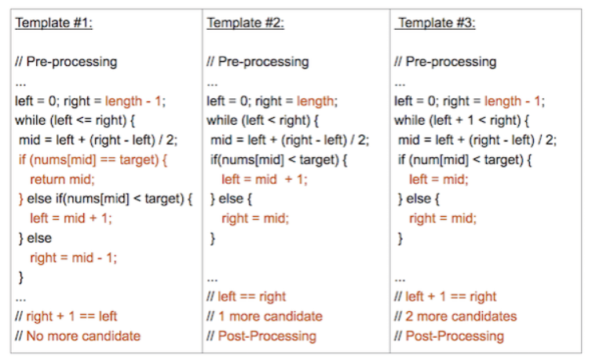
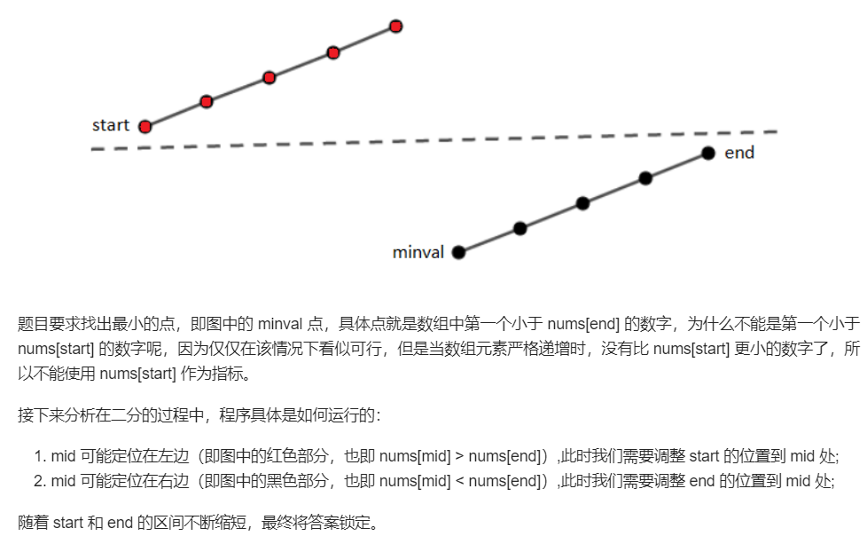

第三个模板的好处是可以根据自己的需要缩圈

重要的是判断 `=` 要往哪走，可以看下面的搜索区间 `LintCode` 的例子

模板三：

在去掉数组大小只有1、2的情况下

长度为2，需要另外考虑

想获得第一个小于等于该元素的值，这个值肯定在start处

- 判断start是否小于，小于直接返回
- 判断start是否等于该值，等于直接返回start-1 （一般是-1）

想获得第一个大于等于该元素的值，这个值肯定在end处，

- 判断end是否


# 二分查找

[二分查找](https://leetcode-cn.com/problems/binary-search/)

给定一个 n 个元素有序的（升序）整型数组 nums 和一个目标值 target  ，写一个函数搜索 nums 中的 target，如果目标值存在返回下标，否则返回 -1。

使用了模板3

```python
class Solution:
    def search(self, nums: List[int], target: int) -> int:
        start=0
        end=len(nums)-1
        while start+1<end:
            mid=(end+start)//2
            if nums[mid]==target: return mid
            elif nums[mid]<target: start=mid
            else: end=mid
        if nums[start]==target: return start
        if nums[end]==target: return end
        return -1
```

# 搜索区间 `LintCode`

给定一个包含 *n* 个整数的排序数组，找出给定目标值 *target* 的起始和结束位置。

如果目标值不在数组中，则返回`[-1, -1]`

思路：

- 用模板三
- 先用二分搜索，搜第一次出现的
- 再二分搜索，搜最后一次出现的

```go
func searchRange (A []int, target int) []int {
    if len(A) == 0 {
        return []int{-1, -1}
    }
    result := make([]int, 2)
    start := 0
    end := len(A) - 1
    for start+1 < end {
        mid := start + (end-start)/2
        if A[mid] > target {
            end = mid
        } else if A[mid] < target {
            start = mid
        } else {
            // 如果相等，应该继续向左找，就能找到第一个目标值的位置
            end = mid
        }
    }
    // 搜索左边的索引
    if A[start] == target {
        result[0] = start
    } else if A[end] == target {
        result[0] = end
    } else {
        result[0] = -1
        result[1] = -1
        return result
    }
    start = 0
    end = len(A) - 1
    for start+1 < end {
        mid := start + (end-start)/2
        if A[mid] > target {
            end = mid
        } else if A[mid] < target {
            start = mid
        } else {
            // 如果相等，应该继续向右找，就能找到最后一个目标值的位置
            start = mid
        }
    }
    // 搜索右边的索引
    if A[end] == target {
        result[1] = end
    } else if A[start] == target {
        result[1] = start
    } else {
        result[0] = -1
        result[1] = -1
        return result
    }
    return result
}
```

# 搜索插入位置

主要思路：

- 依旧是用模板3
- 题目其实是找第一个能插入的位置，所以有相同的值的话，需要插在这个值的第一个出现的位置
- 如果没有相同值，就按情况找start、end、end+1其中的一个返回即可

```python
class Solution:
    def searchInsert(self, nums: List[int], target: int) -> int:
        if len(nums)==0: return 0
        start=0
        end=len(nums)-1
        while start+1<end:
            mid=(start+end)//2
            if nums[mid]>target: end=mid
            else: start=mid
        if nums[start]<target and nums[end]<target: return end+1 #target比s\e都大
        if nums[start]>=target and nums[end]>target: return start #target应该放在s处
        return end #应该放在中间
```

# 搜索二维矩阵

很简单的思路

- 把二维化为一维
- 再二分搜索（可以用模板1、也可以用模板3）

```python
class Solution:
    def searchMatrix(self, matrix: List[List[int]], target: int) -> bool:
        if len(matrix)==0 or len(matrix[0])==0: return False
        matrixN=len(matrix)
        matrixM=len(matrix[0])
        search=[0 for i in range(matrixN*matrixM)]
        for i in range(matrixN):
            for j in range(matrixM):
                search[i*matrixM+j]=matrix[i][j]
        start=0
        end=len(search)-1
        while start<=end:
            mid=(start+end)//2
            # print(search[mid])
            if search[mid]==target: return True
            elif search[mid]>target: end=mid-1
            else: start=mid+1
        return False
```

# 第一个错误的版本号

仍然是用模板3

```python
# The isBadVersion API is already defined for you.
# @param version, an integer
# @return a bool
# def isBadVersion(version):

class Solution:
    def firstBadVersion(self, n):
        """
        :type n: int
        :rtype: int
        """
        if n==0: return 0
        start=1
        end=n
        while start+1<end:
            mid=(start+end)//2
            if isBadVersion(mid)==True: end=mid
            else: start=mid 
        if isBadVersion(start): return start
        return end
```

# 搜索旋转排序数组最小值

[寻找旋转排序数组中的最小值](https://leetcode-cn.com/problems/find-minimum-in-rotated-sorted-array/)



思路如上，主要是要用nums[end]这个分界点来做

```python
class Solution:
    def findMin(self, nums: List[int]) -> int:
        if len(nums)==0: return 0
        start=0
        end=len(nums)-1
        target=nums[end]
        while start+1<end:
            mid=(start+end)//2
            if nums[mid]<=target: end=mid
            else: start=mid
        if nums[start]<nums[end]: return nums[start]
        return nums[end]
# 其实不用设target
class Solution:
    def findMin(self, nums: List[int]) -> int:
        if len(nums)==0: return 0
        start=0
        end=len(nums)-1
        # target=nums[end] <--删掉
        while start+1<end:
            mid=(start+end)//2
            if nums[mid]<=nums[end]: end=mid #<--nums[end]作比较，看mid落在哪里
            else: start=mid
        if nums[start]<nums[end]: return nums[start]
        return nums[end]
```

# 搜索旋转排序数组最小值-ii(有重复元素)

[寻找旋转排序数组中的最小值 II](https://leetcode-cn.com/problems/find-minimum-in-rotated-sorted-array-ii/)

比之前的题多了一个跳过重复元素的操作

`            while start+1<end and nums[end]==nums[end-1]: end-=1 #重点，要跳过重复的元素`
`while start+1<end and nums[start]==nums[start+1]: start+=1`

```python
class Solution:
    def findMin(self, nums: List[int]) -> int:
        if len(nums)==0: return 0
        start=0
        end=len(nums)-1
        while start+1<end:
            while start+1<end and nums[end]==nums[end-1]: end-=1 #重点，要跳过重复的元素
            while start+1<end and nums[start]==nums[start+1]: start+=1
            mid=(start+end)//2
            if nums[mid]<=nums[end]: end=mid
            else: start=mid
        if nums[start]<nums[end]: return nums[start]
        return nums[end]
```

# 搜索旋转排序数组中某个值

主要是要对两条线的，start\mid\end的四种情况有分析

- 相等直接返回
- 如果左半部分是连续的
  - 如果target是在左半部分内的，往左缩圈
  - 如果target不在，往右缩圈
- 如果右半部分是连续的
  - 如果target是在右半部分内，往右缩圈
  - 如果target不在，往左缩圈

```python
class Solution:
    def search(self, nums: List[int], target: int) -> int:
        if len(nums)==0: return -1
        start=0
        end=len(nums)-1
        while start+1<end:
            mid=(start+end)//2
            if nums[mid]==target: return mid #相等直接返回
            elif nums[mid]>nums[start]: #如果左半部分是连续的
                if nums[mid]>target and nums[start]<=target: end=mid  #如果target是在左半部分内的
                else: start=mid
            else:#nums[mid]<nums[end] #如果右半部分是连续的
                if nums[mid]<target and nums[end]>=target: start=mid #如果target是在右半部分内的
                else: end=mid
        if nums[start]==target: return start
        if nums[end]==target: return end
        return -1
```

# 搜索旋转排序数组中某个值-ii

[搜索旋转排序数组 II](https://leetcode-cn.com/problems/search-in-rotated-sorted-array-ii/)

- 跳过重复元素
- 算mid值

- 对两条线的，start\mid\end的四种情况有分析

```python
class Solution:
    def search(self, nums: List[int], target: int) -> bool:
        if len(nums)==0: return False
        start=0
        end=len(nums)-1
        while start+1<end:
            while start<end and nums[start]==nums[start+1]: start+=1
            while start<end and nums[end]==nums[end-1]: end-=1
            mid=(start+end)//2
            if nums[mid]==target: return True
            elif nums[start]<=nums[mid]:
                if nums[start]<=target and target<nums[mid]:end=mid
                else: start=mid
            else: 
                if nums[mid]<target and  target<=nums[end]: start=mid
                else: end=mid
        if nums[start]==target or nums[end]==target: return True
        return False
```

# 二分查找——第一个大于等于查找值的位置

bisect.bisect_left(a, v)

[牛客](https://www.nowcoder.com/practice/7bc4a1c7c371425d9faa9d1b511fe193?tpId=188&tqId=35160&rp=1&ru=%2Fta%2Fjob-code-high-week&qru=%2Fta%2Fjob-code-high-week%2Fquestion-ranking)

```python
#
# 二分查找
# @param n int整型 数组长度
# @param v int整型 查找值
# @param a int整型一维数组 有序数组
# @return int整型
#
class Solution:
    def upper_bound_(self , n , v , a ):
        # write code here
        if len(a)==0: return 1
        i=0
        j=len(a) #why？？？
        while i<j:
            mid=(i+j)//2
            if a[mid]<v: i=mid+1
            else: j=mid
        return i+1
```

