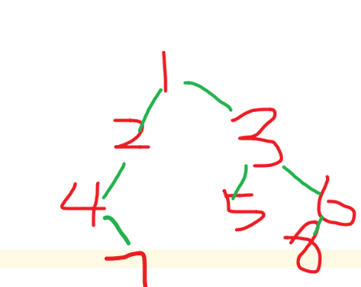

# 二叉树

## 重建二叉树

输入某二叉树的前序遍历和中序遍历的结果，请重建出该二叉树。假设输入的前序遍历和中序遍历的结果中都不含重复的数字。例如输入前序遍历序列{1,2,4,7,3,5,6,8}和中序遍历序列{4,7,2,1,5,3,8,6}，则重建二叉树并返回。

利用前序和后序的关系来构建



```python
# -*- coding:utf-8 -*-
# class TreeNode:
#     def __init__(self, x):
#         self.val = x
#         self.left = None
#         self.right = None
class Solution:
    # 返回构造的TreeNode根节点
    def reConstructBinaryTree(self, pre, tin):
        # write code here
        if not pre or not tin:
            return None
        root=TreeNode(pre.pop(0))
        tin_root_index=tin.index(root.val)
        root.left=self.reConstructBinaryTree(pre,tin[0:tin_root_index])
        root.right=self.reConstructBinaryTree(pre,tin[tin_root_index+1:])
        return root
if __name__=="__main__":
    s=Solution()
    pre=[1,2,4,7,3,5,6,8]
    tin=[4,7,2,1,5,3,8,6]
    root=s.reConstructBinaryTree(pre,tin)
    s.PreOrderTraversal(root)
```


## 序列化与反序列化

```python
# Definition for a binary tree node.
# class TreeNode(object):
#     def __init__(self, x):
#         self.val = x
#         self.left = None
#         self.right = None
from collections import deque
class Codec:
    # root=None
    def serialize(self, root):
        """Encodes a tree to a single string.
        
        :type root: TreeNode
        :rtype: str
        """
        if not root: return "[]" #返回字符串
        result=[]
        queue=deque([root])
        while queue:
            node=queue.popleft()
            if node:
                result.append(str(node.val))
                queue.append(node.left)
                queue.append(node.right)
            else:
                result.append("null")
        return "["+",".join(result)+"]"
            
        

    def deserialize(self, data):
        """Decodes your encoded data to tree.
        
        :type data: str
        :rtype: TreeNode
        """
        if data=="[]": return
        vals,i=data[1:-1].split(","),1
        root=TreeNode(int(vals[0]))
        queue=deque([root])
        while queue:
            node=queue.popleft()
            if vals[i]!="null":
                node.left=TreeNode(int(vals[i]))
                queue.append(node.left)
            i=i+1
            if vals[i]!="null":
                node.right=TreeNode(int(vals[i]))
                queue.append(node.right)
            i=i+1
        return root
        

# Your Codec object will be instantiated and called as such:
# codec = Codec()
# codec.deserialize(codec.serialize(root))
```


## 公共祖先

主要是突出一个思想：

（**一个节点也可以是它自己的祖先**）

所以一旦看到当前节点root是p、q其中一个，立刻返回

```python
# Definition for a binary tree node.
# class TreeNode:
#     def __init__(self, x):
#         self.val = x
#         self.left = None
#         self.right = None

class Solution:
    def lowestCommonAncestor(self, root: 'TreeNode', p: 'TreeNode', q: 'TreeNode') -> 'TreeNode':
        if root==None: return None
        if root==p or root==q: return root
        
        left_node=self.lowestCommonAncestor(root.left,p,q)
        right_node=self.lowestCommonAncestor(root.right,p,q)

        if left_node and right_node:
            return root
        elif left_node and not right_node:
            return left_node
        elif not left_node and right_node:
            return right_node
        else: return None
```


## 二叉树的子结构相同

主要是用深搜DFS来做

只要懂如何用深搜比较两棵树，然后对A的每个节点都这样做就ok了！

```python
# Definition for a binary tree node.
# class TreeNode:
#     def __init__(self, x):
#         self.val = x
#         self.left = None
#         self.right = None

class Solution:
    def isSubStructure(self, A: TreeNode, B: TreeNode) -> bool:
        if A==None or B==None: return False #题目规定，两个初始必不为空
        flag=self.dfs(A,B) or self.isSubStructure(A.left,B) or self.isSubStructure(A.right,B)
        return flag

    def dfs(self,A,B):
        if B==None: return True #b为空了
        if A==None: return False #
        return A.val==B.val and self.dfs(A.left,B.left) and self.dfs(A.right,B.right)
```


## 交换左右节点——二叉树镜像

```python
class Solution:
    def mirrorTree(self, root: TreeNode) -> TreeNode:
        #递归
        # if root==None: return root 
        # if root.left: self.mirrorTree(root.left)
        # if root.right: self.mirrorTree(root.right)
        # root.left,root.right=root.right,root.left
        # return root
        #栈
        if root==None: return root 
        stack=[root]
        while stack:
            node=stack.pop()
            if node!=None:
                node.left,node.right=node.right,node.left
                stack.append(node.left)
                stack.append(node.right)
        return root
```


## 平衡二叉树

```python
#我的做法，内存占用和时间消耗与下一法差不多
class Solution:
    def isBalanced(self, root: TreeNode) -> bool:
        if root==None: return True
        def cmp_depth(root):
            if root==None: return 0,True
            depth_left,flag_left=cmp_depth(root.left)
            depth_right,flag_right=cmp_depth(root.right)
            if flag_left==False or flag_right==False: return 0,False
            if abs(depth_left-depth_right)>1: return 0,False
            return max(depth_left,depth_right)+1,True
        return cmp_depth(root)[1]

#参考评论区，改成一个返回值
class Solution:
    def isBalanced(self, root: TreeNode) -> bool:
        if root==None: return True
        def cmp_depth(root):
            if root==None: return 0
            depth_left=cmp_depth(root.left)
            depth_right=cmp_depth(root.right)
            if depth_left==-1 or depth_right==-1 or abs(depth_left-depth_right)>1: return -1
            else: return max(depth_left,depth_right)+1
        return cmp_depth(root)>0
```


## 二叉树的深度

python的三元表达式

`res='zuo' if x > y else 'you'`

```python
class Solution:
    def maxDepth(self, root: TreeNode) -> int:
        return 0 if root==None else max(self.maxDepth(root.left),self.maxDepth(root.right))+1
```


## 二叉树的子结构

```python
# Definition for a binary tree node.
# class TreeNode:
#     def __init__(self, x):
#         self.val = x
#         self.left = None
#         self.right = None

class Solution:
    def pathSum(self, root: TreeNode, sum: int) -> List[List[int]]:
        res,path=[],[] #result，以及path路径记录
        def search(root,target):
            if root==None:  #直接返回
                return None
            path.append(root.val) #添加到临时路径中，继续往下前序遍历dfs、回溯
            target=target-root.val
            if target==0 and root.left==None and root.right==None: #叶子节点满足，添加到res中
                res.append(list(path)) 
            search(root.left,target) #继续往下前序遍历dfs、回溯
            search(root.right,target) #继续往下前序遍历dfs、回溯
            path.pop()
        search(root,sum)
        return res
```


先说结论：切片[::-1] 有返回值， reverse()函数没有返回值

有返回值的可以 return、赋值。没有的不能 return、赋值。

## [剑指 Offer 32 - III. 从上到下打印二叉树 III](https://leetcode-cn.com/problems/cong-shang-dao-xia-da-yin-er-cha-shu-iii-lcof/)

请实现一个函数按照之字形顺序打印二叉树，即第一行按照从左到右的顺序打印，第二层按照从右到左的顺序打印，第三行再按照从左到右的顺序打印，其他行以此类推。

```python
l.reverse()
print(l)
```

```python
# Definition for a binary tree node.
# class TreeNode:
#     def __init__(self, x):
#         self.val = x
#         self.left = None
#         self.right = None

class Solution:
    def levelOrder(self, root: TreeNode) -> List[List[int]]:
        if not root: return []
        res=[]
        queue=collections.deque([root])
        toggle=0
        while queue:
            list_tmp=[]
            len_layer=len(queue)
            for i in range(len_layer):
                node=queue.popleft()
                list_tmp.append(node.val)
                if node.left: queue.append(node.left)
                if node.right: queue.append(node.right)
            if toggle:
                list_tmp=list_tmp[::-1]
            res.append(list_tmp)
            toggle=toggle^1 #异或 <---
            # toggle=not toggle #取反 <----
            # toggle=(toggle+1)%2 #加一取模<---
        return res
```

## 不同的二叉搜索树-ii

给定一个整数 *n*，生成所有由 1 ... *n* 为节点所组成的 **二叉搜索树** 。

```
示例：

输入：3
输出：
[
  [1,null,3,2],
  [3,2,null,1],
  [3,1,null,null,2],
  [2,1,3],
  [1,null,2,null,3]
]
解释：
以上的输出对应以下 5 种不同结构的二叉搜索树：

   1         3     3      2      1
    \       /     /      / \      \
     3     2     1      1   3      2
    /     /       \                 \
   2     1         2                 3
```

主要是

- 遍历选取不同的根节点
- 然后递归获得左子树的根节点数组，右子树的根节点数组
- 然后创建根节点，遍历左右子树两个for循环，连上根节点，添加到list中

```python
# Definition for a binary tree node.
# class TreeNode:
#     def __init__(self, val=0, left=None, right=None):
#         self.val = val
#         self.left = left
#         self.right = right
class Solution:
    def generateTrees(self, n: int) -> List[TreeNode]:
        if n<=0: return None
        return self.helper(1,n)
    def helper(self,start,end):
        if start>end: return [TreeNode(None)] #这里要注意
        ans=[]
        for i in range(start,end+1): #从零开始遍历
            left=self.helper(start,i-1)
            right=self.helper(i+1,end)
            for leftNode in left: #遍历左节点
                for rightNode in right: #遍历右节点
                    root=TreeNode(i)
                    if leftNode.val!=None:root.left=leftNode
                    if rightNode.val!=None:root.right=rightNode
                    ans.append(root)
        return ans
```

## 二叉树展开为链表

[二叉树展开为链表](https://leetcode-cn.com/problems/flatten-binary-tree-to-linked-list/)

给定一个二叉树，[原地](https://baike.baidu.com/item/原地算法/8010757)将它展开为一个单链表。

前序遍历即可

```python
# Definition for a binary tree node.
# class TreeNode:
#     def __init__(self, val=0, left=None, right=None):
#         self.val = val
#         self.left = left
#         self.right = right
class Solution:
    def flatten(self, root: TreeNode) -> None:
        """
        Do not return anything, modify root in-place instead.
        """
        if root==None: return root
        root_tmp=root
        dummy=TreeNode(0) #哑巴节点
        cur=dummy #用一个cur来当作替身使者
        stack=[]
        while stack or root:
            while root:
                stack.append(root)
                cur.right=TreeNode(root.val)
                cur=cur.right               
                root=root.left
            root=stack.pop().right
        root_tmp.right=dummy.right.right
        root_tmp.left=None
```

# 二叉树的节点间最大距离、路径、这类题

# 124. 二叉树中的最大路径和

[124. 二叉树中的最大路径和](https://leetcode-cn.com/problems/binary-tree-maximum-path-sum/)

```python
# Definition for a binary tree node.
# class TreeNode:
#     def __init__(self, x):
#         self.val = x
#         self.left = None
#         self.right = None
class Solution:
    res=float("-inf")
    def maxPathSum(self, root: TreeNode) -> int:
        def calc(node):
            if node==None: return 0
            left=max(0,calc(node.left))
            right=max(0,calc(node.right))
            self.res=max(self.res,node.val+left+right)
            return max(left,right)+node.val
        return max(calc(root),self.res)
```

