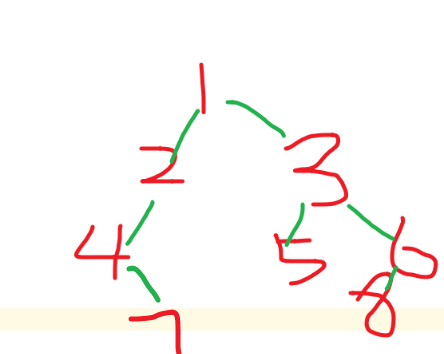

一个整理好的待刷题库

刷一点就登记一点

[宋师傅刷题大纲](https://github.com/songyingxin/python-algorithm)

[刷题库](https://greyireland.gitbook.io/algorithm-pattern/)

[100书](https://github.com/greyireland/awesome-programming-books-1)

[快手](https://www.nowcoder.com/discuss/464053?channel=666&source_id=home_feed)

# 布隆过滤器

# 一、排序

[十大经典排序算法](https://www.cnblogs.com/onepixel/p/7674659.html)


## 1、冒泡排序（Bubble Sort）

​	


# 快速排序的三种做法

- 把pivot基准拿出，然后用新数组装新数组
- 以最高为pivot，然后遍历比pivot小的，装在前面
- 用两个指针，先遍历 j 往左，再遍历 i 往右 。最后要恢复 i 

## [剑指 Offer 45. 把数组排成最小的数](https://leetcode-cn.com/problems/ba-shu-zu-pai-cheng-zui-xiao-de-shu-lcof/)

对于快速排序的第三种做法来说，一般最后要把pivot和i对换。

此时i和j是指向同一个地方的。最后要把pivot和i指向的地方交换

怎么保证这个地方一定小于等于pivot呢？

首先先进行了j的减，这保证j只能在小于pivot的数上停下来。

- 假如j停止后，i移到j的位置，那这个地方一定小于等于pivot
- 加入j没停下来，极端情况下必将移到pivot的首位，其实也是一样的。

然后进行了i的增，这保证了i只能在大于pivot的数上停下来。

- 说明肯定没碰到j，因为j只在小于pivot的数上停下。此时离j还有一定距离

```python
class Solution:
    def minNumber(self, nums: List[int]) -> str:
        def quick_sort(start,end):
            if start>=end: return
            pivot=start
            i,j=start,end
            while i<j:
                while strings[pivot]+strings[j]<=strings[j]+strings[pivot] and i<j: j-=1 #不会在j大的地方停下
                while strings[pivot]+strings[i]>=strings[i]+strings[pivot] and i<j: i+=1 #不会在i小的地方停下
                strings[i],strings[j]=strings[j],strings[i]
            strings[i],strings[pivot]=strings[pivot],strings[i] #最后肯定是i==j了，并且该位置是小于pivot的
            quick_sort(start,i-1) #这里的start要注意一下
            quick_sort(i+1,end) #这里的
        strings=[str(num) for num in nums]
        quick_sort(0,len(strings)-1)
        return ''.join(strings)
```

## 最小的k个数

写了三种排序的方法

```python
class Solution:
    def getLeastNumbers(self, arr: List[int], k: int) -> List[int]:
        # 冒泡排序
        # for i in range(len(arr)):
        #     for j in range(len(arr)-i-1):
        #         if arr[j]>arr[j+1]:
        #             arr[j],arr[j+1]=arr[j+1],arr[j]
        # 自带排序
        # arr.sort()
        # 快排
        # def fast_sort(l,r):
        #     if l>=r: return
        #     pivot_i=l #缺少了一点取中位数的技巧
        #     i,j=l,r
        #     while i<j:
        #         while arr[j]>=arr[pivot_i] and i<j: j-=1
        #         while arr[i]<=arr[pivot_i] and i<j: i+=1
        #         arr[i],arr[j]=arr[j],arr[i]
        #     arr[i],arr[pivot_i]=arr[pivot_i],arr[i]
        #     fast_sort(l,i-1)
        #     fast_sort(i+1,r)
        # fast_sort(0,len(arr)-1)
        # 快排另一种写法
        # def fast_sort(arr):
        #     if not arr: return []
        #     len_arr=len(arr)
        #     pivot=arr.pop(len_arr//2)
        #     left=[]
        #     right=[]
        #     for i in range(len_arr-1):
        #         if arr[i]>pivot: right.append(arr[i])
        #         else: left.append(arr[i])
        #     return fast_sort(left)+[pivot]+fast_sort(right)
        # arr=fast_sort(arr)
        # 归并排序
        def merge_sort(listA):
            if len(listA)<=1: return listA
            left=merge_sort(listA[:len(listA)//2])
            right=merge_sort(listA[len(listA)//2:])
            res,i,j=[],0,0
            while i<len(left) and j<len(right):
                if left[i]<right[j]: 
                    res.append(left[i])
                    i+=1
                else: 
                    res.append(right[j])
                    j+=1
            res=res+left[i:]+right[j:]
            return res
        arr=merge_sort(arr)
        return arr[:k]
```


# 树

## 重建二叉树

输入某二叉树的前序遍历和中序遍历的结果，请重建出该二叉树。假设输入的前序遍历和中序遍历的结果中都不含重复的数字。例如输入前序遍历序列{1,2,4,7,3,5,6,8}和中序遍历序列{4,7,2,1,5,3,8,6}，则重建二叉树并返回。

利用前序和后序的关系来构建



```python
# -*- coding:utf-8 -*-
# class TreeNode:
#     def __init__(self, x):
#         self.val = x
#         self.left = None
#         self.right = None
class Solution:
    # 返回构造的TreeNode根节点
    def reConstructBinaryTree(self, pre, tin):
        # write code here
        if not pre or not tin:
            return None
        root=TreeNode(pre.pop(0))
        tin_root_index=tin.index(root.val)
        root.left=self.reConstructBinaryTree(pre,tin[0:tin_root_index])
        root.right=self.reConstructBinaryTree(pre,tin[tin_root_index+1:])
        return root
if __name__=="__main__":
    s=Solution()
    pre=[1,2,4,7,3,5,6,8]
    tin=[4,7,2,1,5,3,8,6]
    root=s.reConstructBinaryTree(pre,tin)
    s.PreOrderTraversal(root)
```


## 序列化与反序列化

```python
# Definition for a binary tree node.
# class TreeNode(object):
#     def __init__(self, x):
#         self.val = x
#         self.left = None
#         self.right = None
from collections import deque
class Codec:
    # root=None
    def serialize(self, root):
        """Encodes a tree to a single string.
        
        :type root: TreeNode
        :rtype: str
        """
        if not root: return "[]" #返回字符串
        result=[]
        queue=deque([root])
        while queue:
            node=queue.popleft()
            if node:
                result.append(str(node.val))
                queue.append(node.left)
                queue.append(node.right)
            else:
                result.append("null")
        return "["+",".join(result)+"]"
            
        

    def deserialize(self, data):
        """Decodes your encoded data to tree.
        
        :type data: str
        :rtype: TreeNode
        """
        if data=="[]": return
        vals,i=data[1:-1].split(","),1
        root=TreeNode(int(vals[0]))
        queue=deque([root])
        while queue:
            node=queue.popleft()
            if vals[i]!="null":
                node.left=TreeNode(int(vals[i]))
                queue.append(node.left)
            i=i+1
            if vals[i]!="null":
                node.right=TreeNode(int(vals[i]))
                queue.append(node.right)
            i=i+1
        return root
        

# Your Codec object will be instantiated and called as such:
# codec = Codec()
# codec.deserialize(codec.serialize(root))
```


## 公共祖先

主要是突出一个思想：

（**一个节点也可以是它自己的祖先**）

所以一旦看到当前节点root是p、q其中一个，立刻返回

```python
# Definition for a binary tree node.
# class TreeNode:
#     def __init__(self, x):
#         self.val = x
#         self.left = None
#         self.right = None

class Solution:
    def lowestCommonAncestor(self, root: 'TreeNode', p: 'TreeNode', q: 'TreeNode') -> 'TreeNode':
        if root==None: return None
        if root==p or root==q: return root
        
        left_node=self.lowestCommonAncestor(root.left,p,q)
        right_node=self.lowestCommonAncestor(root.right,p,q)

        if left_node and right_node:
            return root
        elif left_node and not right_node:
            return left_node
        elif not left_node and right_node:
            return right_node
        else: return None
```


## 二叉树的子结构相同

主要是用深搜DFS来做

只要懂如何用深搜比较两棵树，然后对A的每个节点都这样做就ok了！

```python
# Definition for a binary tree node.
# class TreeNode:
#     def __init__(self, x):
#         self.val = x
#         self.left = None
#         self.right = None

class Solution:
    def isSubStructure(self, A: TreeNode, B: TreeNode) -> bool:
        if A==None or B==None: return False #题目规定，两个初始必不为空
        flag=self.dfs(A,B) or self.isSubStructure(A.left,B) or self.isSubStructure(A.right,B)
        return flag

    def dfs(self,A,B):
        if B==None: return True #b为空了
        if A==None: return False #
        return A.val==B.val and self.dfs(A.left,B.left) and self.dfs(A.right,B.right)
```


## 交换左右节点——二叉树镜像

```python
class Solution:
    def mirrorTree(self, root: TreeNode) -> TreeNode:
        #递归
        # if root==None: return root 
        # if root.left: self.mirrorTree(root.left)
        # if root.right: self.mirrorTree(root.right)
        # root.left,root.right=root.right,root.left
        # return root
        #栈
        if root==None: return root 
        stack=[root]
        while stack:
            node=stack.pop()
            if node!=None:
                node.left,node.right=node.right,node.left
                stack.append(node.left)
                stack.append(node.right)
        return root
```


## 平衡二叉树

```python
#我的做法，内存占用和时间消耗与下一法差不多
class Solution:
    def isBalanced(self, root: TreeNode) -> bool:
        if root==None: return True
        def cmp_depth(root):
            if root==None: return 0,True
            depth_left,flag_left=cmp_depth(root.left)
            depth_right,flag_right=cmp_depth(root.right)
            if flag_left==False or flag_right==False: return 0,False
            if abs(depth_left-depth_right)>1: return 0,False
            return max(depth_left,depth_right)+1,True
        return cmp_depth(root)[1]

#参考评论区，改成一个返回值
class Solution:
    def isBalanced(self, root: TreeNode) -> bool:
        if root==None: return True
        def cmp_depth(root):
            if root==None: return 0
            depth_left=cmp_depth(root.left)
            depth_right=cmp_depth(root.right)
            if depth_left==-1 or depth_right==-1 or abs(depth_left-depth_right)>1: return -1
            else: return max(depth_left,depth_right)+1
        return cmp_depth(root)>0
```


## 二叉树的深度

python的三元表达式

`res='zuo' if x > y else 'you'`

```python
class Solution:
    def maxDepth(self, root: TreeNode) -> int:
        return 0 if root==None else max(self.maxDepth(root.left),self.maxDepth(root.right))+1
```


## 二叉树的子结构

```python
# Definition for a binary tree node.
# class TreeNode:
#     def __init__(self, x):
#         self.val = x
#         self.left = None
#         self.right = None

class Solution:
    def pathSum(self, root: TreeNode, sum: int) -> List[List[int]]:
        res,path=[],[] #result，以及path路径记录
        def search(root,target):
            if root==None:  #直接返回
                return None
            path.append(root.val) #添加到临时路径中，继续往下前序遍历dfs、回溯
            target=target-root.val
            if target==0 and root.left==None and root.right==None: #叶子节点满足，添加到res中
                res.append(list(path)) 
            search(root.left,target) #继续往下前序遍历dfs、回溯
            search(root.right,target) #继续往下前序遍历dfs、回溯
            path.pop()
        search(root,sum)
        return res
```


先说结论：切片[::-1] 有返回值， reverse()函数没有返回值

有返回值的可以 return、赋值。没有的不能 return、赋值。

## [剑指 Offer 32 - III. 从上到下打印二叉树 III](https://leetcode-cn.com/problems/cong-shang-dao-xia-da-yin-er-cha-shu-iii-lcof/)

请实现一个函数按照之字形顺序打印二叉树，即第一行按照从左到右的顺序打印，第二层按照从右到左的顺序打印，第三行再按照从左到右的顺序打印，其他行以此类推。

```python
l.reverse()
print(l)
```

```python
# Definition for a binary tree node.
# class TreeNode:
#     def __init__(self, x):
#         self.val = x
#         self.left = None
#         self.right = None

class Solution:
    def levelOrder(self, root: TreeNode) -> List[List[int]]:
        if not root: return []
        res=[]
        queue=collections.deque([root])
        toggle=0
        while queue:
            list_tmp=[]
            len_layer=len(queue)
            for i in range(len_layer):
                node=queue.popleft()
                list_tmp.append(node.val)
                if node.left: queue.append(node.left)
                if node.right: queue.append(node.right)
            if toggle:
                list_tmp=list_tmp[::-1]
            res.append(list_tmp)
            toggle=toggle^1 #异或 <---
            # toggle=not toggle #取反 <----
            # toggle=(toggle+1)%2 #加一取模<---
        return res
```

## 不同的二叉搜索树-ii

给定一个整数 *n*，生成所有由 1 ... *n* 为节点所组成的 **二叉搜索树** 。

```
示例：

输入：3
输出：
[
  [1,null,3,2],
  [3,2,null,1],
  [3,1,null,null,2],
  [2,1,3],
  [1,null,2,null,3]
]
解释：
以上的输出对应以下 5 种不同结构的二叉搜索树：

   1         3     3      2      1
    \       /     /      / \      \
     3     2     1      1   3      2
    /     /       \                 \
   2     1         2                 3
```

主要是

- 遍历选取不同的根节点
- 然后递归获得左子树的根节点数组，右子树的根节点数组
- 然后创建根节点，遍历左右子树两个for循环，连上根节点，添加到list中

```python
# Definition for a binary tree node.
# class TreeNode:
#     def __init__(self, val=0, left=None, right=None):
#         self.val = val
#         self.left = left
#         self.right = right
class Solution:
    def generateTrees(self, n: int) -> List[TreeNode]:
        if n<=0: return None
        return self.helper(1,n)
    def helper(self,start,end):
        if start>end: return [TreeNode(None)] #这里要注意
        ans=[]
        for i in range(start,end+1): #从零开始遍历
            left=self.helper(start,i-1)
            right=self.helper(i+1,end)
            for leftNode in left: #遍历左节点
                for rightNode in right: #遍历右节点
                    root=TreeNode(i)
                    if leftNode.val!=None:root.left=leftNode
                    if rightNode.val!=None:root.right=rightNode
                    ans.append(root)
        return ans
```


# 二进制

## 众数

- 字典hash
- 排序中位数
- 摩尔投票法

```python
#我的写法
class Solution:
    def majorityElement(self, nums: List[int]) -> int:
        # dic={}
        dic=dict() #创建方式也不熟悉
        for x in nums:
            if x in dic: dic[x]+=1
            else: dic[x]=1
        len_nums=len(nums)//2
        # for key,value in dic.items(): #主要是dict的迭代还不熟悉
            # if value>len_nums: return key
        for key in dic.keys():
            if dic[key]>len_nums: return key
        return None
```

摩尔投票法

```python
class Solution:
    def majorityElement(self, nums: List[int]) -> int:    
    	votes=0
        for num in nums:
            if votes==0: x=num
            votes+=1 if x==num else -1
        return x
```

# 设计 栈

## [剑指 Offer 30. 包含min函数的栈](https://leetcode-cn.com/problems/bao-han-minhan-shu-de-zhan-lcof/)

```python
class MinStack:

    def __init__(self):
        """
        initialize your data structure here.
        """
        self.A=[]
        self.B=[]

    def push(self, x: int) -> None:
        self.A.append(x)
        # if not self.B: self.B.append(x)
        # elif x<=self.B[-1]: self.B.append(x)
        if not self.B or x<=self.B[-1]: self.B.append(x)

    def pop(self) -> None:
        if not self.A: return #可不写？
        x=self.A.pop()
        if x==self.B[-1]: self.B.pop()

    def top(self) -> int:
        if not self.A: return #可不写？
        return self.A[-1]

    def min(self) -> int:
        if not self.B: return #可不写？
        return self.B[-1]


# Your MinStack object will be instantiated and called as such:
# obj = MinStack()
# obj.push(x)
# obj.pop()
# param_3 = obj.top()
# param_4 = obj.min()
```

# 双指针、链表

## 链表倒数第k个数

```python
# Definition for singly-linked list.
# class ListNode:
#     def __init__(self, x):
#         self.val = x
#         self.next = None

class Solution:
    def getKthFromEnd(self, head: ListNode, k: int) -> ListNode:
        # if not head or k==0: return None
        # root=head
        # res=[]
        # while root:
        #     res.append(root)             
        #     root=root.next
        # if k>len(res): return None
        # return res[-k]
        former,latter=head,head
        for _ in range(k):
            if not former: return
            former=former.next
        while former:
            former,latter=former.next,latter.next
        return latter
```

## 反转链表

```python
# Definition for singly-linked list.
# class ListNode:
#     def __init__(self, x):
#         self.val = x
#         self.next = None

class Solution:
    def reverseList(self, head: ListNode) -> ListNode:
        if head==None: return head
        node_i=head
        node_j=head.next
        node_i.next=None
        while node_j!=None:
            tmp=node_j.next
            node_j.next=node_i
            node_i=node_j
            node_j=tmp	
        return node_i
```

## 删除链表中某个值

要考虑好head就是要删的值的情况

```python
# Definition for singly-linked list.
# class ListNode:
#     def __init__(self, x):
#         self.val = x
#         self.next = None
#递归写法
class Solution:
    def deleteNode(self, head: ListNode, val: int) -> ListNode:
        if head==None: return None
        if head.val==val: return head.next
        head.next=self.deleteNode(head.next,val)
        return head
#leetcode，以下面的Solution为准        
#我写的
class Solution:
    def deleteNode(self, head: ListNode, val: int) -> ListNode:
        if head==None: return None
        if head.val==val: return head.next
        node_i=head
        node_j=head.next
        while node_j!=None:
            if node_j.val==val:
                node_i.next=node_j.next
            node_i=node_j
            node_j=node_j.next
        return head


```


# 动态规划

## 剪绳子-1

```python
class Solution:
    def cuttingRope(self, n: int) -> int:
        res=[0 for i in range(n+1)]
        res[1]=1
        for i in range(2,n+1):
            for j in range(1,i//2+1):
                res[i]=max(res[i],max(j,res[j])*max(i-j,res[i-j]))
        print(res)
        return res[n]
```

## 剪绳子-2

```python
class Solution:
    def cuttingRope(self, n: int) -> int:
        opt=[0 for i in range(n+1)]
        opt[1]=1
        for i in range(2,n+1):
            for j in range(1,i//2+1):
                opt[i]=max(opt[i],max(opt[j],j)*max(opt[i-j],i-j))
        return opt[n]%1000000007
```

## 丑数

我们把只包含质因子 2、3 和 5 的数称作丑数（Ugly Number）。求按从小到大的顺序的第 n 个丑数。

```python
class Solution:
    def nthUglyNumber(self, n: int) -> int:
        res=[1]*(n)
        a=b=c=0
        for i in range(1,n):
            res[i]=min(res[a]*2,res[b]*3,res[c]*5)
            if res[i]==res[a]*2: a+=1
            if res[i]==res[b]*3: b+=1
            if res[i]==res[c]*5: c+=1     
        # print(res)                   
        return res[n-1]
```


# 堆

```python

class Solution:
    def getLeastNumbers(self, arr: List[int], k: int) -> List[int]:
        if k == 0:
            return []
        heaplist = HeapList()
        heaplist.buildHeap(arr[:k])
        for i in arr[k:]:
            if i < heaplist.heaplist[1]:
                heaplist.delMax()
                heaplist.insert(i)
        return heaplist.heaplist[1:]

class HeapList():
    """
    大顶堆
    """
    def __init__(self):
        self.heaplist = [0]
        self.size = 0

    def buildHeap(self, alist):
         i = len(alist) // 2
         self.size = len(alist)
         self.heaplist += alist[:]
         while i > 0:
             self.percDown(i)
             i -= 1

    def delMax(self):
        """删除堆顶最大元素"""
        retval = self.heaplist[1]
        self.heaplist[1] = self.heaplist[self.size]
        self.size -= 1
        self.heaplist.pop()
        self.percDown(1)
        return retval

    def insert(self, k):
        self.heaplist.append(k)
        self.size += 1
        self.percUP(self.size)

    def percUP(self, i):
        while i // 2 > 0:
            if self.heaplist[i] > self.heaplist[i // 2]:
                self.heaplist[i], self.heaplist[i // 2] = self.heaplist[i // 2], self.heaplist[i]
            i //= 2

    def percDown(self, i):
        while i * 2 <= self.size:
            mc = self.maxChild(i)
            if self.heaplist[i] < self.heaplist[mc]:
                self.heaplist[i], self.heaplist[mc] = self.heaplist[mc], self.heaplist[i]
            i = mc

    def maxChild(self, i):
        if 2 * i + 1 > self.size:
            return 2 * i
        else:
            if self.heaplist[2 * i] > self.heaplist[2 * i + 1]:
                return 2 * i
            else:
                return 2 * i + 1

作者：tian-di-jing-yi-BOwgvqig49
链接：https://leetcode-cn.com/problems/zui-xiao-de-kge-shu-lcof/solution/nei-zhi-sort-kuai-pai-si-xiang-zui-da-dui-san-chon/
来源：力扣（LeetCode）
著作权归作者所有。商业转载请联系作者获得授权，非商业转载请注明出处。
```

# LRU

[LRU缓存机制](https://leetcode-cn.com/problems/lru-cache/)

运用你所掌握的数据结构，设计和实现一个  LRU (最近最少使用) 缓存机制。它应该支持以下操作： 获取数据 get 和 写入数据 put 。

获取数据 get(key) - 如果关键字 (key) 存在于缓存中，则获取关键字的值（总是正数），否则返回 -1。
写入数据 put(key, value) - 如果关键字已经存在，则变更其数据值；如果关键字不存在，则插入该组「关键字/值」。当缓存容量达到上限时，它应该在写入新数据之前删除最久未使用的数据值，从而为新的数据值留出空间。

**进阶:**

你是否可以在 **O(1)** 时间复杂度内完成这两种操作？

理解：用Hash字典、双链表构造LRU（Least Recently Used）最近最少使用

```python
class DLinkedNode:
    def __init__(self,key=0,value=0):
        self.key=key
        self.value=value
        self.prev=None
        self.next=None

class LRUCache:

    def __init__(self, capacity: int):
        self.cache=dict() #哈希字典
        self.capacity=capacity #容量
        self.size=0 #已用大小
        self.head=DLinkedNode() #哑巴头节点
        self.tail=DLinkedNode() #哑巴尾节点
        self.head.next=self.tail
        self.tail.prev=self.head

    def get(self, key: int) -> int:
        if key not in self.cache:
            return -1
        node=self.cache[key]
        self.moveToHead(node) #删除,移至头节点
        return node.value

    def put(self, key: int, value: int) -> None: #放置
        if key not in self.cache:
            node=DLinkedNode(key,value)
            self.cache[key]=node
            self.addToHead(node)
            self.size+=1
            if self.size>self.capacity:
                removedNode=self.removeTail()
                self.cache.pop(removedNode.key)
                self.size-=1
        else:
            node=self.cache[key]
            node.value=value
            self.moveToHead(node)
    def addToHead(self,node): #加到头节点
        node.prev=self.head
        node.next=self.head.next
        self.head.next.prev=node
        self.head.next=node

    def removeNode(self,node): #删除节点
        node.prev.next=node.next #node的前个节点的下一个节点指针，指向node的下一个节点 
        node.next.prev=node.prev #node的下节点的前一个节点指针，指向node的前一个节点

    def removeTail(self): #删除尾节点前的节点
        node=self.tail.prev
        self.removeNode(node)
        return node

    def moveToHead(self,node): #移到头节点
        self.removeNode(node) #先删除
        self.addToHead(node) #后台添加


# Your LRUCache object will be instantiated and called as such:
# obj = LRUCache(capacity)
# param_1 = obj.get(key)
# obj.put(key,value)
```

