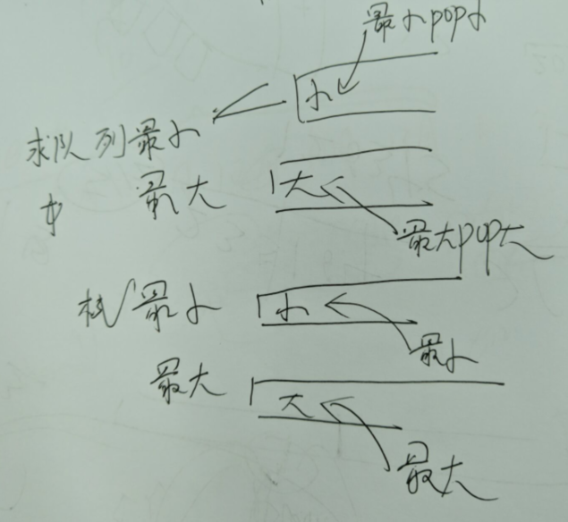

设计题

# [面试题 03.02. 栈的最小值](https://leetcode-cn.com/problems/min-stack-lcci/)

装第一个值：

- 比deque[-1]大的，不装
- 比deque[-1]小的，装

# [146. LRU缓存机制](https://leetcode-cn.com/problems/lru-cache/)

```python
class DLinkedNode:
    def __init__(self,key=0,value=0):
        self.key=key
        self.value=value
        self.prev=None
        self.next=None

class LRUCache:

    def __init__(self, capacity: int):
        self.cache=dict() #哈希字典
        self.capacity=capacity #容量
        self.size=0 #已用大小
        self.head=DLinkedNode() #哑巴头节点
        self.tail=DLinkedNode() #哑巴尾节点
        self.head.next=self.tail
        self.tail.prev=self.head

    def get(self, key: int) -> int:
        if key not in self.cache:
            return -1
        node=self.cache[key]
        self.moveToHead(node) #删除,移至头节点
        return node.value

    def put(self, key: int, value: int) -> None:
        if key not in self.cache:
            node=DLinkedNode(key,value)
            self.cache[key]=node
            self.addToHead(node)
            self.size+=1
            if self.size>self.capacity:
                removedNode=self.removeTail()
                self.cache.pop(removedNode.key)
                self.size-=1
        else:
            node=self.cache[key]
            node.value=value
            self.moveToHead(node)
    def addToHead(self,node):
        node.prev=self.head
        node.next=self.head.next
        self.head.next.prev=node
        self.head.next=node

    def removeNode(self,node): #删除节点
        node.prev.next=node.next #node的前个节点的下一个节点指针，指向node的下一个节点 
        node.next.prev=node.prev #node的下节点的前一个节点指针，指向node的前一个节点

    def removeTail(self):
        node=self.tail.prev
        self.removeNode(node)
        return node
    def moveToHead(self,node):
        self.removeNode(node)
        self.addToHead(node)


# Your LRUCache object will be instantiated and called as such:
# obj = LRUCache(capacity)
# param_1 = obj.get(key)
# obj.put(key,value)
```


# 59 - II. 队列的最大值

[剑指 Offer 59 - II. 队列的最大值](https://leetcode-cn.com/problems/dui-lie-de-zui-da-zhi-lcof/)

装第一个值：

- 比deque[-1]大的，循环去掉deque[-1]，装入
- 比deque[-1]小的，直接装

```python
from collections import deque
class MaxQueue:

    def __init__(self):
        self.queue=deque()
        self.deque=deque()

    def max_value(self) -> int:
        if self.deque:
            return self.deque[0]
        else:
            return -1

    def push_back(self, value: int) -> None:
        while self.deque and self.deque[-1]<value: #比deque[-1]大的，循环去掉deque[-1]，装入
            self.deque.pop()
        self.queue.append(value)
        self.deque.append(value)

    def pop_front(self) -> int:
        if self.queue:
            v=self.queue.popleft()
            if v==self.deque[0]:
                self.deque.popleft()
            return v
        else: return -1


# Your MaxQueue object will be instantiated and called as such:
# obj = MaxQueue()
# param_1 = obj.max_value()
# obj.push_back(value)
# param_3 = obj.pop_front()
```

# 单调队列

[剑指 Offer 59 - I. 滑动窗口的最大值](https://leetcode-cn.com/problems/hua-dong-chuang-kou-de-zui-da-zhi-lcof/)

判断窗口内的最大值：

```python
from collections import deque
import sys
class Solution:
    def maxSlidingWindow(self, nums: List[int], k: int) -> List[int]:
        if not nums or k==0: return []
        res=[-sys.maxsize for i in range(len(nums)-k+1)]
        deque=collections.deque()
        for i in range(k): #首先做一个窗口
            while deque and deque[-1]<nums[i]: #相同的不删，所以不怕重复值
                deque.pop()
            deque.append(nums[i])
        res[0]=deque[0]
        for i in range(k,len(nums)):
            if deque[0]==nums[i-k]: #如果最大值要退出窗口，就删除
                deque.popleft()
            while deque and deque[-1]<nums[i]:
                deque.pop()
            deque.append(nums[i])
            res[i-k+1]=deque[0] #从1号下标开始，因为0号下标已经装了
        return res
```

# 用队列模拟滑动窗口

[剑指 Offer 48. 最长不含重复字符的子字符串](https://leetcode-cn.com/problems/zui-chang-bu-han-zhong-fu-zi-fu-de-zi-zi-fu-chuan-lcof/)


# 单调栈和单调队列

对于FIFO队列来说，想以O(1)的复杂度获得其任何时刻的最小值\最大值的话，需要加一个辅助的单调队列

- 最小值：初始值先push入辅助队列，
  - 然后如果原队列push进更小的A元素，就将A元素push入辅助队列，把小于A元素值的元素都pop出来
  - 然后如果原队列push进更大的A元素，就将A元素push入辅助队列
- 最大值同上，以下是示例

对于FILO的栈来说

最小值：初始值先push入辅助队列，

- 然后如果原队列push进更大的A元素，什么都不做，~~就将A元素push入辅助队列~~
- 然后如果原队列push进更小的A元素，就将A元素push入辅助队列，~~把小于A元素值的元素都pop出来~~

