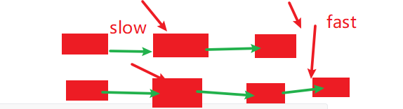

# 通用操作

链表类

```python
# Definition for singly-linked list.
class ListNode:
     def __init__(self, x):
         self.val = x
         self.next = None

```

创建头指针

```python
dummy=ListNode(0)
dummy.next=head
head=dummy
```

向前移动指针

```python
head=head.next #移动到下一个指针
```

删除next节点

```python
head.next=head.next.next #删除next节点
```

反转链表，也可以是双指针操作的模板：备改二移

pre是一个始终在head前的节点

```python
pre=None
while head!=None:
     tmp=head.next #备份节点
     head.next=pre #改变指针
     pre=head #移动指针
     head=tmp #移动指针
```

用快慢指针找中点<---重要

- fast 如果初始化为 head.Next 则中点在 slow.Next

- fast 初始化为 head,则中点在 slow

```python
    def findMiddle(self,head):
        slow=head
        fast=head.next
        while fast!=None and fast.next!=None:
            fast=fast.next.next
            slow=slow.next #小fast一倍的速度，最终会在fast达到链表尾时，达到中点
        return slow
```



# 链表去重-i

思路：遍历链表，使相同元素缩减为1

主要的困难在于dummy头节点的保持，以及head的next判断

```python
# Definition for singly-linked list.
# class ListNode:
#     def __init__(self, x):
#         self.val = x
#         self.next = None

class Solution:
    def deleteDuplicates(self, head: ListNode) -> ListNode:
        dummpy=ListNode(0) #通用操作
        dummpy.next=head
        while head!=None:
            while head.next!=None and head.next.val==head.val: #这里是while
                head.next=head.next.next
            head=head.next
        return dummpy.next
```

# 链表去重-ii

思路：遍历链表，使相同元素缩减为1

主要的困难在于dummy头节点的保持，以及head的next判断

重点

```python
#head=head.next #删除的错误操作，这只是移动到下一个指针
head.next=head.next.next #删除的正确操作，这才是删除
```

代码

```python
# Definition for singly-linked list.
# class ListNode:
#     def __init__(self, x):
#         self.val = x
#         self.next = None

class Solution:
    def deleteDuplicates(self, head: ListNode) -> ListNode:
		dummy=ListNode(0)
        dummy.next=head
        head=dummy
        while head.next!=None:
            if head.next.next!=None and head.next.next.val==head.next.val: #重点是这里的判断之后，就确定有重复了
                retain=head.next.val #然后取出重复的数
                while head.next and head.next.val==retain: #不断地遍历
                    #head=head.next #删除的错误操作，这只是遍历
                    head.next=head.next.next #删除的正确操作，这才是删除
            else: head=head.next
        return dummy.next
```


# 反转单链表——经典

[反转单链表](https://leetcode-cn.com/problems/reverse-linked-list/)

```python
# Definition for singly-linked list.
# class ListNode:
#     def __init__(self, x):
#         self.val = x
#         self.next = None

class Solution:
    def reverseList(self, head: ListNode) -> ListNode:
        pre=None
        while head!=None:
            tmp=head.next #备份节点
            head.next=pre #改变指针
            pre=head #移动指针
            head=tmp #移动指针
        return pre
```

# 反转链表（m,n）

与反转链表差不多

重点是将 **关键的四个节点：反转的关节点**、**以及链表的头指针Dummy记录好**

```python
# Definition for singly-linked list.
# class ListNode:
#     def __init__(self, x):
#         self.val = x
#         self.next = None

class Solution:
    def reverseBetween(self, head: ListNode, m: int, n: int) -> ListNode:
        if head==None: return None
        i=0
        head_dummpy=ListNode(0)
        head_dummpy.next=head
        head=head_dummpy
        pre_node=head #作为要反转前的第一个节点
        while i<m:
            pre_node=head #pre是这样用的
            head=head.next
            i+=1
        first_node=head #作为要反转的第一个节点
        pre_node2=None  #作为反转的最后一个节点
        while i<=n:
            tmp=head.next #备份
            head.next=pre_node2 #切换
            pre_node2=head #移动
            head=tmp #移动
            i+=1
        first_node.next=head #此时head已经是反转链表后的第一个节点了
        pre_node.next=pre_node2
        return head_dummpy.next
```


# 有序链表合并

[有序链表合并](https://leetcode-cn.com/problems/merge-two-sorted-lists/submissions/)

思路：创建新链表，遍历两个旧链表，一个一个连上，与归并排序的合并差不多

```python
# Definition for singly-linked list.
# class ListNode:
#     def __init__(self, val=0, next=None):
#         self.val = val
#         self.next = next
class Solution:
    def mergeTwoLists(self, left: ListNode, right: ListNode) -> ListNode:
        lr=ListNode(0)
        lrDummy=lr
        # if left==None and l2==None: return None
        while left and right:
            if left.val<=right.val:
                lr.next=left
                left=left.next
            else:
                lr.next=right
                right=right.next
            lr=lr.next #不要忘了移动
        if left:
            lr.next=left
        else:
            lr.next=right
        return lrDummy.next
```

# 排序链表

在 *O*(*n* log *n*) 时间复杂度和常数级空间复杂度下，对链表进行排序。

根据题目要求，我们需要使用快排，或者归并排序

思路就不赘述了

快排：本意是想用分隔链表的操作来做的，但是没做成功。超时了，需要再测试测试，应该是陷入了死循环或者死递归

```python
# Definition for singly-linked list.
# class ListNode:
#     def __init__(self, x):
#         self.val = x
#         self.next = None

class Solution:
    def sortList(self, head: ListNode) -> ListNode:
        if head==None or head.next==None: return head
        pivot=head #基准值
        head=head.next #移动
        leftList=ListNode(0) #头节点
        left_i=leftList
        rightList=ListNode(0) #头节点
        right_i=rightList
        while head!=None:  #本意是想用分隔链表的操作来做的，但是没做成功
            print(head.val)
            if head.val<=pivot.val:
                left_i.next=head
                left_i=left_i.next
            else:
                right_i.next=head
                right_i=right_i.next
            head=head.next
        leftList=self.sortList(leftList.next) #左边的
        rightList=self.sortList(rightList.next) #右边的
        resultList=pivot
        if leftList:
            resultList=leftList
            while leftList.next!=None:
                leftList=leftList.next
            leftList.next=pivot
        pivot.next=rightList
        return resultList
```

归并：

- **用快慢指针找中点<---重要**
- 用有序链表合并算法合并左右两个链表

```python
# Definition for singly-linked list.
# class ListNode:
#     def __init__(self, x):
#         self.val = x
#         self.next = None

class Solution:
    def sortList(self, head: ListNode) -> ListNode: #排序总函数
        if head==None or head.next==None: return head
        middle=self.findMiddle(head)
        tail=middle.next #右边的链表
        middle.next=None #分开两个链表
        leftL=self.sortList(head)
        rightL=self.sortList(tail)
        return self.mergeTwoList(leftL,rightL)
    def findMiddle(self,head): #找中点
        slow=head
        fast=head.next
        while fast!=None and fast.next!=None:
            fast=fast.next.next
            slow=slow.next #小fast一倍的速度，最终会在fast达到链表尾时，达到中点
        return slow
    def mergeTwoList(self,left,right): #排序两个链表的函数
        lr=ListNode(0)
        lrDummy=lr
        # if left==None and l2==None: return None
        while left and right:
            if left.val<=right.val:
                lr.next=left
                left=left.next
            else:
                lr.next=right
                right=right.next
            lr=lr.next #不要忘了移动
        if left:
            lr.next=left
        else:
            lr.next=right
        return lrDummy.next
```


# 分隔链表

[leetcode 86题 分隔链表](https://leetcode-cn.com/problems/partition-list/)


给定一个链表和一个特定值 x，对链表进行分隔，使得所有小于 x 的节点都在大于或等于 x 的节点之前。

你应当保留两个分区中每个节点的初始相对位置。

示例:

```
输入: head = 1->4->3->2->5->2, x = 3
输出: 1->2->2->4->3->5
```

其实这道题思路蛮简单的，就是代码写起来容易混乱。

**要对链表的增删查改足够清晰**

对于这道题，主要是是删除\跳过的操作一点不清晰，就会写不出来

- 首先需要一个Dummy节点，这个节点是我们新的头节点，这是创建之后就不能动的

- 然后使 `Dummy.next=head` ，这一步使得Dummy正式成为头节点

- 然后使 `head=Dummy` ，这一步使得head从Dummy开始遍历（然后while循环就可以从head.next开始了）

- 然后我们先取出要删除的节点，然后再`head.next=head.next.next`

  ```python
  tmp=head.next #先备份该节点
  head.next=head.next.next #删除一个节点的操作
  ```

- 然后就删除成功了

```python
# Definition for singly-linked list.
# class ListNode:
#     def __init__(self, x):
#         self.val = x
#         self.next = None

class Solution:
    def partition(self, head: ListNode, x: int) -> ListNode:
        if head==None: return head
        headDummy=ListNode(0) #Dummy是作为新的链表的头指针的
        headDummy.next=head
        head=headDummy

        tailDummy=ListNode(0) #tailDummy是作为第二个链表的头指针的
        tail=tailDummy

        while head.next:
            if head.next.val<x:
                head=head.next
            else:
                #tmp=head.next #先备份该节点
                #head.next=head.next.next #删除一个节点的操作
                #tail.next=tmp #放到另一个链表
                #tail=tail.next
                
                tail.next=head.next#<--可以先放到tail上，再删除，而不是先删除再放到tial上
                tail=tail.next
                head.next=head.next.next                
        tail.next=None
        head.next=tailDummy.next
        return headDummy.next

```

# 重排链表

[leetcode 143](https://leetcode-cn.com/problems/reorder-list/)

给定一个单链表 L：L0→L1→…→Ln-1→Ln ，
将其重新排列后变为： L0→Ln→L1→Ln-1→L2→Ln-2→…

你不能只是单纯的改变节点内部的值，而是需要实际的进行节点交换。

示例 1:

```
给定链表 1->2->3->4, 重新排列为 1->4->2->3.
```

示例 2:

```
给定链表 1->2->3->4->5, 重新排列为 1->5->2->4->3.
```


**思路**

- 快慢指针找中点，根据中点拆分链表
- 使右链表逆转
- 合并两链表，一左一右地合并，最后再合并最后一个不为空的


```python
# Definition for singly-linked list.
# class ListNode:
#     def __init__(self, val=0, next=None):
#         self.val = val
#         self.next = next
class Solution:
    def reorderList(self, head: ListNode) -> None:
        """
        Do not return anything, modify head in-place instead.
        """
        if head==None: return None
        midlle=self.findMidlle(head)
        tail=midlle.next
        tail=self.reverse(tail) #反转后面的链表
        midlle.next=None #拆分链表
        Dummy=ListNode(0) #创建头节点
        List_res=Dummy
        while head and tail: #合并两链表，一左一右地合并
            List_res.next=head
            List_res=List_res.next
            head=head.next

            List_res.next=tail
            List_res=List_res.next
            tail=tail.next
        if head: #最后再合并最后一个不为空的
            List_res.next=head
        else:
            List_res.next=tail
        return Dummy.next
    def reverse(self,head): #逆转链表
        if head==None or head.next==None: return head
        pre=None
        while head!=None:
            tmp=head.next
            head.next=pre
            pre=head
            head=tmp
        return pre
    def findMidlle(self,head): #找中点
        slow=head
        fast=head.next
        while fast and fast.next:
            fast=fast.next.next
            slow=slow.next
        return slow
```

# 环形链表-i

[环形链表-i](https://leetcode-cn.com/problems/linked-list-cycle/)

给定一个链表，判断链表中是否有环。

为了表示给定链表中的环，我们使用整数 pos 来表示链表尾连接到链表中的位置（索引从 0 开始）。 如果 pos 是 -1，则在该链表中没有环。

**思路**

主要思路还是快慢指针，如果由

```python
# Definition for singly-linked list.
# class ListNode:
#     def __init__(self, x):
#         self.val = x
#         self.next = None

class Solution:
    def hasCycle(self, head: ListNode) -> bool:
        if head==None: return False
        slow=head
        fast=head.next
        while fast and fast.next:
            if fast==slow:
                return True
            fast=fast.next.next
            slow=slow.next
        return False
```

#  环形链表-ii

找环的入口点：

- 首先快慢指针找到中点
- 然后fast会到head节点，slow移动到中点，二者同步向前移动，**最终相遇时即是环的入口点？**

```python
# Definition for singly-linked list.
# class ListNode:
#     def __init__(self, x):
#         self.val = x
#         self.next = None

class Solution:
    def detectCycle(self, head: ListNode) -> ListNode:
        if head==None: return head
        fast=head.next
        slow=head
        while fast and fast.next:
            if fast==slow:
                fast=head
                slow=slow.next
                while fast!=slow:
                    fast=fast.next
                    slow=slow.next
                return slow
            fast=fast.next.next
            slow=slow.next
        return None
```

# 深拷贝链表：dfs、dict、有丝分裂

- 哈希表深拷贝
- 有丝分裂法

```python
"""
# Definition for a Node.
class Node:
    def __init__(self, x: int, next: 'Node' = None, random: 'Node' = None):
        self.val = int(x)
        self.next = next
        self.random = random
"""
#DFS哈希表深拷贝
class Solution:
    def copyRandomList(self, head: 'Node') -> 'Node':
        lookup = {}
        def dfs(head):
            if not head: return None
            if head in lookup: return lookup[head]
            clone = Node(head.val, None, None)
            lookup[head] = clone 
            clone.next, clone.random = dfs(head.next), dfs(head.random)
            return clone
        return dfs(head)

#哈希表深拷贝
class Solution:
    def copyRandomList(self, head: 'Node') -> 'Node':
        if head==None: return None
        visited=dict()
        cur=head
        while cur: #首先只考虑把所有的节点的值都hash存起来
            visited[cur]=Node(cur.val,None,None)
            cur=cur.next
        cur=head
        while cur:
            visited[cur].next=visited.get(cur.next)
            visited[cur].random=visited.get(cur.random)
            cur=cur.next
        return visited[head]
#有丝分裂法
class Solution:
    def copyRandomList(self, head: 'Node') -> 'Node':
        if head==None: return None
        current=head
        while current!=None: #首先先有丝分裂
            clone=Node(current.val,current.next)
            temp=current.next
            current.next=clone
            current=temp
        current=head
        while current!=None: #然后复制random节点
            if current.random!=None:
                current.next.random=current.random.next
            current=current.next.next
        current=head
        cloneHead=current.next
        while current!=None and current.next!=None: #最后删除老节点
            temp=current.next
            current.next=current.next.next
            current=temp
        return cloneHead #返回
        # visited=dict()
        # Dummy=Node(0)
        # Dummy.next=Node()
        # while head:
        #     if head not in visited:
        #         head	
```


# 两链表的公共节点

[剑指offer 52](https://leetcode-cn.com/problems/liang-ge-lian-biao-de-di-yi-ge-gong-gong-jie-dian-lcof/)

主要是参透了

a+c+b=b+c+a

即三者相加距离相同，就可以找到答案

设交集链表长c,链表1除交集的长度为a，链表2除交集的长度为b，有

- a + c + b = b + c + a
- 若无交集，则a + b = b + a

```python
# Definition for singly-linked list.
# class ListNode:
#     def __init__(self, x):
#         self.val = x
#         self.next = None

class Solution:
    def getIntersectionNode(self, headA: ListNode, headB: ListNode) -> ListNode:
        h1,h2=headA,headB
        while h1!=h2:
            h1=headB if h1==None else h1.next
            h2=headA if h2==None else h2.next
        return h1
```

# 两两交换链表中的节点

[两两交换链表中的节点](https://leetcode-cn.com/problems/swap-nodes-in-pairs/submissions/)

主要要用tmp把暂时无关的节点存好

```python
# Definition for singly-linked list.
# class ListNode:
#     def __init__(self, x):
#         self.val = x
#         self.next = None

class Solution:
    def swapPairs(self, head: ListNode) -> ListNode:
        if not head or not head.next: return head
        tmpnext=head.next.next
        tmp=head.next
        tmp.next=head
        head.next=self.swapPairs(tmpnext)
        return tmp
```

# 各种环形链表的题（6种）

https://www.cnblogs.com/yorkyang/p/10876604.html

# 环形链表入口节点

[牛客](https://www.nowcoder.com/practice/6e630519bf86480296d0f1c868d425ad?tpId=188&rp=1&ru=%2Fta%2Fjob-code-high-week&qru=%2Fta%2Fjob-code-high-week%2Fquestion-ranking)

```python
# class ListNode:
#     def __init__(self, x):
#         self.val = x
#         self.next = None

#
# 
# @param head ListNode类 
# @return ListNode类
#
class Solution:
    def detectCycle(self , head ):
        # write code here
        slow,fast=head,head
        while fast and fast.next:
            fast=fast.next.next
            slow=slow.next
            if fast==slow:
                slow=head
                while fast!=slow:
                    fast=fast.next
                    slow=slow.next
                return fast
        return None
```

# 每K个节点一翻转

https://www.nowcoder.com/practice/b49c3dc907814e9bbfa8437c251b028e?tpId=188&&tqId=35450&rp=1&ru=/ta/job-code-high-week&qru=/ta/job-code-high-week/question-ranking

```java
import java.util.*;

/*
 * public class ListNode {
 *   int val;
 *   ListNode next = null;
 * }
 */

public class Solution {
    /**
     * 
     * @param head ListNode类 
     * @param k int整型 
     * @return ListNode类
     */
    public static ListNode reverseKGroup(ListNode head, int k) {
		if(head == null || head.next == null || k < 2) return head;
		ListNode dummy = new ListNode(0);
		dummy.next = head;
		ListNode pre = dummy, cur = head, temp;
		int len = 0;
		while (head != null) {
			len ++ ;
			head = head.next;
		}
		for (int i = 0; i < len / k; i ++ ) {
			for (int j = 1; j < k; j ++ ) {
				temp = cur.next;
				cur.next = temp.next;
				temp.next = pre.next;
				pre.next = temp;
			}
			pre = cur;
			cur = cur.next;
		}
		return dummy.next;
	}
}
```

