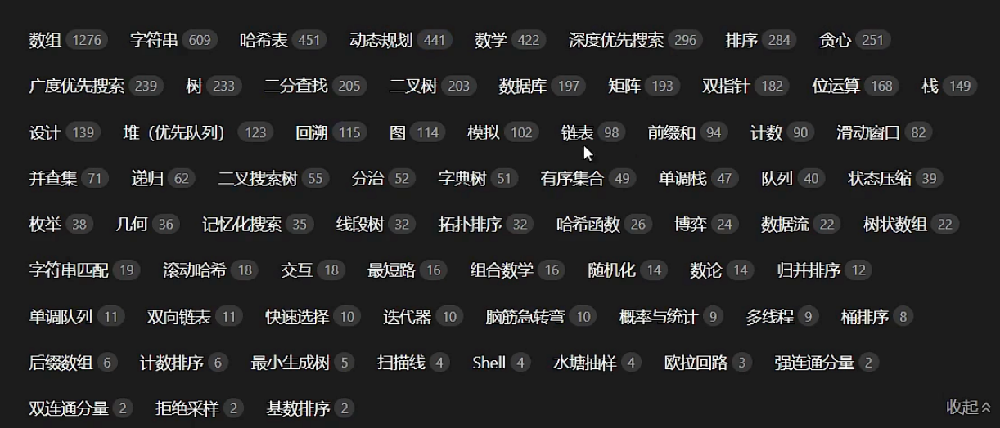

What I have learned:

 Array

List

1. Linked List
2. Double Linked List

Hashmap

Graph

1. Weighted Graph: A graph in which an edge has weight or costs associated with it.
2. Unweighted Graph: an inverse version of Weighted Graph
3. Complete Graph: A graph in which each vertex is connected to every other vertex.
4. Directed Graph/Digraph
5. Undirected Graph

Heap

1. Maximum Heap
2. Minimum Heap

Tree

1. Full Binary Tree
2. Binary Balanced Tree
3. Complete Binary Balanced Tree
4. Perfect Binary Tree
5. Degenerate Binary Tree
6. N-Node Tree
7. B Tree
8. B+ Tree

TBD:

For example:

