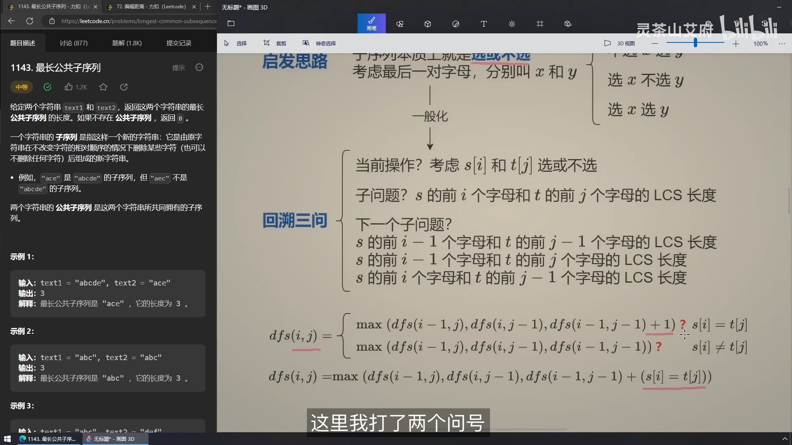

【最长公共子序列 编辑距离】 https://www.bilibili.com/video/BV1TM4y1o7ug/?share_source=copy_web&vd_source=5d4accef9045e3ed4e08bbb7a80f3c70

术语

1. 子数组、子串：subarray/substring，一般是连续的
2. 子序列：subsequence，是不连续的

# 01 例题最长公共子序列

启发思路：

1. 两个字符串的每个字母对，本质上也是选或不选。

考虑字符串S1和S2的最后一对字母X与Y，有

1. 选X和Y
2. 选X，不选Y
3. 不选X，选Y
4. 不选X，不选Y

则最长公共子序列有两种情况，对于s1[i]=X和s2[j]=Y

1. 如果X=Y
   1. dfs(i, j) = max(dfs(i-1, j), dfs(i, j-1), dfs(i-1, j-1)+1)
   2. 对于dfs(i, j)，如果X=Y。那么dfs(i-1, j-1)的长度一定>=max(dfs(i-1, j), dfs(i, j-1))，所以我们在X=Y的情况下可以忽略dfs(i-1, j), dfs(i, j-1)，所以有：
   3. dfs(i, j) = dfs(i-1, j-1)+1
2. 如果X≠Y
   1. dfs(i, j) = max(dfs(i-1, j), dfs(i, j-1), dfs(i-1, j-1))
   2. 对于X≠Y，dfs(i-1, j)不考虑j的情况就变成了dfs(i-1, j-1)。dfs(i, j-1)不考虑i的情况也变成了dfs(i-1, j-1)。dfs(i-1, j-1)是被max(dfs(i-1, j), dfs(i, j-1))包含在内的，所以有：
   3. dfs(i, j) = max(dfs(i-1, j), dfs(i, j-1))

灵神的回溯、递归三步走

1. 当前操作对应着根据当前的判断（X=Y）做出的选择
2. 子问题，是计算当前dfs(i, j)
3. 下一个子问题，是计算当前的dfs(i, j)，需要多少下一个子问题来联合判断

# 02 [72. Edit Distance](https://leetcode.cn/problems/edit-distance/)

编辑距离：

1. if(x=y)
   1. dfs(i, j) = dfs(i-1, j-1)
2. else
   1. Dfs(i, j) = min(dfs(i-1, j) + dfs(i, j-1) + dfs(i-1, j-1)) + 1

