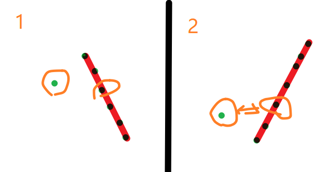

# 1.两数之和

```java
class Solution {
    public int[] twoSum(int[] nums, int target) {
        Map<Integer,Integer> map=new HashMap<>();
        for(int i=0;i<nums.length;i++){
            if(map.containsKey(target-nums[i])){
                return new int[]{map.get(target-nums[i]),i};
            }else{
                map.put(nums[i],i);
            }
        }
        return null;

    }
}
```


# 2. 链表相加

```java
/**
 * Definition for singly-linked list.
 * public class ListNode {
 *     int val;
 *     ListNode next;
 *     ListNode(int x) { val = x; }
 * }
 */
class Solution {
    public ListNode addTwoNumbers(ListNode l1, ListNode l2) {
        ListNode dummy=new ListNode(0);
        ListNode head=dummy;
        int carry=0;
        while(l1!=null || l2!=null || carry!=0){
            if(l1!=null){
                carry+=l1.val;
                l1=l1.next;
            }
            if(l2!=null){
                carry+=l2.val;
                l2=l2.next;
            }
            head.next=new ListNode(carry%10);
            head=head.next;
            carry=carry/10;
        }
        return dummy.next;
    }
}
```


# 4.两个正序数组的中位数

https://leetcode-cn.com/problems/median-of-two-sorted-arrays/

给定两个大小为 m 和 n 的正序（从小到大）数组 nums1 和 nums2。

请你找出这两个正序数组的中位数，并且要求算法的时间复杂度为 O(log(m + n))。

你可以假设 nums1 和 nums2 不会同时为空。


这道题其实可以扩展成，在O(log(m + n))	的时间复杂度内，找到第K大的数

1. 为了计算第K位的数，先判断两数组A、B在第k//2的数的大小，*如果A的该数比B大*，则可以判断，B在第K//2之前的数肯定不是我们要找的target，则把这些数删掉，将K减去K//2，继续递归遍历。

2. 要处理一些边界条件：

   我们需要始终保持A比B长。

   当B长度为零时就可以直接返回，减少了递归深度。

   如果寻找的K为排在第1位的数，则比较两数组的第1位数，并返回

3. 对于中位数而言，我们可以分别计算第    length//2+1、length//2+2  的值

   总长度奇数条件下，前者后者都是中间的值

   总长度偶数条件下，前者是第一个中位数，后者是第二个。两者之均，正好是中位数的值

```python
class Solution:
    def findMedianSortedArrays(self, nums1: List[int], nums2: List[int]) -> float:
        def helper(nums1,nums2,k):
            if len(nums1)<len(nums2): 
                nums2,nums1=nums1,nums2
            if len(nums2)==0: 
                return nums1[k-1]
            if k==1: 
                return min(nums1[0],nums2[0])
            ksub=min(k//2,len(nums2))
            if nums1[ksub-1]>=nums2[ksub-1]: 
                return helper(nums1,nums2[ksub:],k-ksub)
            else: 
                return helper(nums1[ksub:],nums2,k-ksub)
        left=(len(nums1)+len(nums2)+1)//2
        right=(len(nums1)+len(nums2)+2)//2
        return (helper(nums1,nums2,left)+helper(nums1,nums2,right))/2
```


其实上面的比较A、B的长度，并且交换，是可以避免的。

开局先判断两个数组是否为空，然后判断k==1

接下来就比较两数组的k//2的大小，来进一步缩小查找范围：

- 只可能有一个数组的长度不到k//2，因为k从一开始就是被约束好的
- 如果B数组长度不为K/2，那么一定可以把A数组的前K/2个数去掉，因为这K/2个数必不是target

```java
class Solution {
    public double findMedianSortedArrays(int[] nums1, int[] nums2) {
        int left=(nums1.length+nums2.length+1)/2;
        int right=(nums1.length+nums2.length+2)/2;
        return (findKNum(nums1,0,nums2,0,left)+findKNum(nums1,0,nums2,0,right))/2.0;
    }
    public int findKNum(int[] nums1,int i,int[] nums2,int j,int k){
        if(i>=nums1.length) return nums2[j+k-1];
        if(j>=nums2.length) return nums1[i+k-1];
        if(k==1){
            return Math.min(nums1[i],nums2[j]);//两个数组此时都不为空
        }
        int nums1mid=(i+k/2-1<nums1.length)?nums1[i+k/2-1]:Integer.MAX_VALUE;
        int nums2mid=(j+k/2-1<nums2.length)?nums2[j+k/2-1]:Integer.MAX_VALUE;
        if(nums1mid<nums2mid){
            return findKNum(nums1,i+k/2,nums2,j,k-k/2);
        }else{
            return findKNum(nums1,i,nums2,j+k/2,k-k/2);
        }
    }
}
```

# 5.最长回文子串

```java
class Solution {
    public String longestPalindrome(String s) {
        if(s.length()<2) return s;
        int maxLen=1;
        int left=0;
        int right=0;
        boolean[][] dp=new boolean[s.length()][s.length()];
        for(int i=0;i<s.length();i++) dp[i][i]=true;
        //Arrays.fill(dp[0],true);
        //System.out.printf("%b,%b,%b",dp[0][1],dp[0][1],dp[0][1]);
        //System.out.println(dp[0][1]);
        for(int j=1;j<s.length();j++){
            for(int i=0;i<j;i++){
                if(s.charAt(i)==s.charAt(j)){
                    if(j-i<=2 || dp[i+1][j-1]==true){
                        dp[i][j]=true;
                        if(maxLen<j-i+1){
                            left=i;
                            right=j;
                            maxLen=j-i+1;
                        }
                        //System.out.printf("\n%d,%d,%d",1,i,j);
                        //System.out.printf("\n%d,%d,%d",left,right,maxLen);
                    }
                }
            }
        }
        return s.substring(left,right+1);
    }
}
```

# 10. 正则表达式匹配

[10. 正则表达式匹配](https://leetcode-cn.com/problems/regular-expression-matching/)

```java
// return text.matches("^"+pattern+"$");

class Solution {
    public boolean isMatch(String text, String pattern) {
        char[] str=text.toCharArray();
        char[] ptr=pattern.toCharArray();
        boolean[][] dp=new boolean[str.length+1][ptr.length+1];
        dp[0][0]=true;
        for(int i=0;i<str.length+1;i++){
            for(int j=1;j<ptr.length+1;j++){
                if(ptr[j-1]=='*'){
                    if(j>1) dp[i][j]=dp[i][j-2]; //*匹配为空，这是很重要的初始化步骤
                    //*匹配一个到多个字符，最后会落到空上
                    if(i>0 && (str[i-1]==ptr[j-2] || ptr[j-2]=='.')) dp[i][j]=dp[i][j] | dp[i-1][j];
                }else{
                    //正常匹配
                    if(i>0  && (str[i-1]==ptr[j-1] || ptr[j-1]=='.')) dp[i][j]=dp[i][j] | dp[i-1][j-1];
                }
            }
        }
        return dp[str.length][ptr.length];

    }
}
```


# 11.盛水最多的容器

```java
class Solution {
    public int maxArea(int[] height) {
        int res=0;
        int i=0;
        int j=height.length-1;
        while(i<j){
            res=Math.max(res,Math.min(height[i],height[j])*(j-i));
            if(height[i]<height[j]){
                i+=1;
            }else{
                j-=1;
            }
        }
        return res;
    }
}
```

# 15. 三数之和

[15. 三数之和](https://leetcode-cn.com/problems/3sum/)

```java
class Solution {
    public List<List<Integer>> threeSum(int[] nums) {
        List<List<Integer>> res=new ArrayList();
        int len=nums.length;
        if(nums==null || len<3) return res;
        Arrays.sort(nums);
        for(int i=0;i<len;i++){
            if(nums[i]>0) return res;
            if(i>0 && nums[i]==nums[i-1]) continue;
            int left=i+1;
            int right=len-1;
            while(left<right){
                int sum=nums[i]+nums[left]+nums[right];
                if(sum==0){
                    res.add(Arrays.asList(nums[i],nums[left],nums[right]));
                    while(left<right && nums[left]==nums[left+1]) left++;
                    while(left<right && nums[right]==nums[right-1]) right--;
                    left++;
                    right--;
                }else if(sum<0){
                    left++;
                }else{
                    right--;
                }
            }
        }
        return res;
    }
}
```


# 17. 电话号码的字母组合

```python
class Solution:
    def letterCombinations(self, digits: str) -> List[str]:
        if len(digits)==0: return []
        res=[]
        tmp=[]
        d={'2': ['a', 'b', 'c'],
               '3': ['d', 'e', 'f'],
               '4': ['g', 'h', 'i'],
               '5': ['j', 'k', 'l'],
               '6': ['m', 'n', 'o'],
               '7': ['p', 'q', 'r', 's'],
               '8': ['t', 'u', 'v'],
               '9': ['w', 'x', 'y', 'z']}
        def traceback(digits,index):
            if index==len(digits):
                res.append("".join(tmp))
                return
            dt=d[digits[index]]
            for i in range(len(dt)):
                tmp.append(dt[i])
                traceback(digits,index+1)
                tmp.pop()
        traceback(digits,0)
        return res
```


**Java**

[17. 电话号码的字母组合](https://leetcode-cn.com/problems/letter-combinations-of-a-phone-number/)

回溯法

```java
class Solution {
    public List<String> letterCombinations(String digits) {
        List<String> list = new ArrayList<>();
        if (digits == null || digits.length() == 0) {
            return list;
        }
        Map<Character, String> map = new HashMap<>();
        map.put('2', "abc");
        map.put('3', "def");
        map.put('4', "ghi");
        map.put('5', "jkl");
        map.put('6', "mno");
        map.put('7', "pqrs");
        map.put('8', "tuv");
        map.put('9', "wxyz");
        backTrack(list, digits, map, 0, new StringBuilder());
        return list;
    }

    private void backTrack(List<String> list, String digits, Map<Character, String> map, int index, StringBuilder sb) {

        if (sb.length() == digits.length()) {
            list.add(sb.toString());
            return;
        }
        String value = map.get(digits.charAt(index));
        for (int j = 0; j < value.length(); j++) {
            backTrack(list, digits, map, index + 1, sb.append(value.charAt(j)));
            sb.deleteCharAt(sb.length() - 1);
        }
    }
}

```

队列法

```java
class Solution {
    public List<String> letterCombinations(String digits) {
        List<String> list = new ArrayList<>();
        if (digits == null || digits.length() == 0) {
            return list;
        }
        Map<Character, String> map = new HashMap<>();
        map.put('2', "abc");
        map.put('3', "def");
        map.put('4', "ghi");
        map.put('5', "jkl");
        map.put('6', "mno");
        map.put('7', "pqrs");
        map.put('8', "tuv");
        map.put('9', "wxyz");
        backTrack(list, digits, map, 0, new StringBuilder());
        return list;
    }

    private void backTrack(List<String> list, String digits, Map<Character, String> map, int index, StringBuilder sb) {

        if (sb.length() == digits.length()) {
            list.add(sb.toString());
            return;
        }
        String value = map.get(digits.charAt(index));
        for (int j = 0; j < value.length(); j++) {
            backTrack(list, digits, map, index + 1, sb.append(value.charAt(j)));
            sb.deleteCharAt(sb.length() - 1);
        }
    }
}

```


# 19. 删除链表的倒数第N个节点

在处理的时候，可以使用哑巴节点，

- 来规避链表只有一个节点的情况，
- 并且可以保持在 `target` 前一位，用于删除节点

然后，想摘掉快节点移动的步数，其实是有组合的：

- 如果快节点只先移动 `k-1` 步，那么我们在一起移动时，需要时刻注意 `f.next` 是否为空
- 如果快节点只先移动 `k` 步，那么我们在一起移动时，需要时刻注意 `f` 是否为空

[删除链表的倒数第N个节点](https://leetcode-cn.com/problems/remove-nth-node-from-end-of-list/)

```java
/**
 * Definition for singly-linked list.
 * public class ListNode {
 *     int val;
 *     ListNode next;
 *     ListNode(int x) { val = x; }
 * }
 */
class Solution {
    public ListNode removeNthFromEnd(ListNode head, int n) {
        ListNode f=head;
        while(n>1 && f.next!=null){//快指针
            f=f.next;
            n=n-1;
        }
        ListNode res=new ListNode(0);//哑巴节点
        res.next=head;
        ListNode tmp=res;//tmp用于移动，删除
        while(f.next!=null){//快慢指针一起移动
            tmp=tmp.next;
            f=f.next;
        }
        if(tmp.next!=null)
            tmp.next=tmp.next.next;
        return res.next;

    }
}
```

# 20.有效的括号

[20. 有效的括号](https://leetcode-cn.com/problems/valid-parentheses/)

```python
class Solution:
    def isValid(self, s: str) -> bool:
        while "{}" in s or "()" in s or "[]" in s:
            s=s.replace("{}","")
            s=s.replace("[]","")
            s=s.replace("()","")
        return s==""
```

# 31.下一个排列

[下一个排列](https://leetcode-cn.com/problems/next-permutation/solution/xia-yi-ge-pai-lie-suan-fa-xiang-jie-si-lu-tui-dao-/)

对于这种题：大于此数的下一个数（情况1）、小于此数的上一个数（情况2） 都可以用统一的套路求解



取第一种情况讨论：

- 目标是，找到一个逆序对，`A[i] < A[j]` ，交换其，然后将 `A[i:]`  做一个升序排列
  - `A[j]` 必须尽可能的靠后
  - 先从后往前找到一个相邻的逆序对，`A[i]< A[j]` ，其中跳过的 `A[j:]` 肯定是降序排列
  - 然后从后往前找到第一个大于 `A[i]` 的 `A[k]` ，交换 `A[k]、A[i]` 
  - 然后将 `A[i+1:]` 升序排列（因为我们要找的是在交换 `A[k]、A[i]`  后的最大的数）
  - 如果没有找到逆序对，就直接跳到 `升序排列`  

```java
class Solution {
    public void nextPermutation(int[] nums) {
        if(nums.length<=1) return ;
        int i=nums.length-2,j=nums.length-1,k=nums.length-1;
        while(i>=0 && nums[i]>=nums[j]){ //找到第一个逆序对
            i--;
            j--;
        }
        if(i>=0){ 
            while(nums[k]<=nums[i]){ // 找到第一个大于nums[i]的数，等于是不行的，没有效果
                k--;
            }
            int tmp=nums[k];
            nums[k]=nums[i];
            nums[i]=tmp;
        }
        for(int l=j,r=nums.length-1;l<r;l++,r--){ //后面都是升序的，需要调成降序排序
            int tmp=nums[l];
            nums[l]=nums[r];
            nums[r]=tmp;
        }
    
    }
}
```

# 32.最长有效括号

[最长有效括号](https://leetcode-cn.com/problems/longest-valid-parentheses/submissions/)

- 当`【i】`是 `右括号` 时

  - 先判断它左边是不是 `左括号` ，是的话 `dp[i]+2`

  - 上面的情况不对的话，判断它左边的 `dp[i-1]` 是否大于零（代表左边有有效括号组），并且跳过这个dp[i-1]的长度之后，能找到一个 `左括号`  与其匹配，dp[i]=d[i-1]+2

  - 最后判断，`i-dp[i]>0` 与 `i-dp[i]` 处的 dp 值是否大于零，这代表着 `dp[i]` 为代表的括号组左边还有有效的括号组。

    如果大于零（其实等于零也可以直接加哈哈哈），`dp[i]+=dp[i-dp[i]]`

- 左括号，直接continue

```java
class Solution {
    public int longestValidParentheses(String s) {
        char[] sc=s.toCharArray();
        int[] dp=new int[sc.length];
        int max=0;
        //System.out.println(dp[0]);
        for(int i=0;i<sc.length;i++){ 
            if(i>0 && sc[i]==')'){ //判断是否是右括号
                if(sc[i-1]=='('){//左边直接就是一个左括号？
                    dp[i]=2;
                }else if(dp[i-1]>0 && i-dp[i-1]-1>=0 && sc[i-dp[i-1]-1]=='('){
                        dp[i]=dp[i-1]+2;
                }else{ //其他情况直接跳过
                    continue;
                }
                //这边做一个判断，判断是否可以加上之前的值
                if(i-dp[i]>=1 && dp[i-dp[i]]>0) dp[i]+=dp[i-dp[i]];
                max=Math.max(max,dp[i]);

            }else{
                continue;
            }
            
        }
        //System.out.println(Arrays.toString(dp));
        return max;
    }
}
```


# 34. 在排序数组中查找元素的第一个和最后一个位置

[34. 在排序数组中查找元素的第一个和最后一个位置](https://leetcode-cn.com/problems/find-first-and-last-position-of-element-in-sorted-array/)

```python
class Solution:
    def searchRange(self, nums: List[int], target: int) -> List[int]:
        if len(nums)==0: return [-1,-1]
        left=-1
        right=-1
        i=0
        j=len(nums)-1
        while i<j:
            mid=(i+j)//2
            if nums[mid]>=target: j=mid
            else: i=mid+1
        if nums[i]==target: left=i
        i=0
        j=len(nums)-1
        while i<j:
            mid=(i+j)//2
            if nums[mid]<=target: i=mid+1
            else: j=mid
        if i>0 and nums[i]!=target and nums[i-1]==target: i=i-1
        if nums[i]==target: right=i 
        return [left,right]
```

# 42.接雨水__单调栈经典题

[42接雨水](https://leetcode-cn.com/problems/trapping-rain-water/)

```python
class Solution:
    def trap(self, height: List[int]) -> int:
        stack=[]
        res=0
        for i in range(len(height)):
            while stack and height[stack[-1]]<height[i]:
                top=stack.pop()
                if len(stack)==0: break
                l=stack[-1]
                r=i 
                h=min(height[l],height[r])-height[top]
                res+=h*(r-l-1)
            stack.append(i)
        return res
```

# 46. 全排列__回溯经典题

[46. 全排列](https://leetcode-cn.com/problems/permutations/)

```python
class Solution:
    def permute(self, nums: List[int]) -> List[List[int]]:
        res=[]
        d=dict()
        tmp=[]
        def backtrace(d,tmp):
            if len(tmp)==len(nums):
                res.append(tmp[:])
                return
            for i in range(len(nums)):
                if d.get(nums[i]): continue
                d[nums[i]]=True
                tmp.append(nums[i])
                backtrace(d,tmp)
                d[nums[i]]=False
                tmp.pop()
        backtrace(d,tmp)
        return res
```

# 48.旋转图像

[48.旋转图像](https://leetcode-cn.com/problems/rotate-image/)

```java
class Solution {
    public void rotate(int[][] matrix) {
        if(matrix.length==0 || matrix.length!=matrix[0].length){
            return;
        }
        int len=matrix.length;
        int layer=0;
        while(layer<=(len>>1)){
            int lalen=len-(layer<<1);
            for(int i=0;i<lalen-1;i++){
                int tmp=matrix[layer][layer+i];
                matrix[layer][layer+i]=matrix[layer+lalen-i-1][layer];
                matrix[layer+lalen-1-i][layer]=matrix[layer+lalen-1][layer+lalen-1-i];
                matrix[layer+lalen-1][layer+lalen-1-i]=matrix[layer+i][layer+lalen-1];
                matrix[layer+i][layer+lalen-1]=tmp;
            }
            layer++;
        }
    }
}
```

# 49. 字母异位词分组

[49. 字母异位词分组](https://leetcode-cn.com/problems/group-anagrams/)

```java
class Solution {
    public List<List<String>> groupAnagrams(String[] strs) {
        HashMap<String,ArrayList<String>> map=new HashMap<>();
        for(String s:strs){
            char[] ch=s.toCharArray();
            Arrays.sort(ch);
            String key=String.valueOf(ch);
            if(!map.containsKey(key)) map.put(key,new ArrayList<>());
            map.get(key).add(s);
        }
        return new ArrayList(map.values());
    }
}
```

# 53. 最大子序和

[53. 最大子序和](https://leetcode-cn.com/problems/maximum-subarray/)

```python
class Solution:
    def maxSubArray(self, nums: List[int]) -> int:
        if nums==[]: return None
        maxV=nums[0]
        for i in range(1,len(nums)):
            nums[i]=max(nums[i-1]+nums[i],nums[i])
            maxV=max(maxV,nums[i])
        return maxV
```

# 55. 跳跃游戏_扩展:最少跳数

[55. 跳跃游戏](https://leetcode-cn.com/problems/jump-game/)

```java
class Solution {
    public boolean canJump(int[] nums) {
        int maxp=0; //维护一个最大值
        int nowmp=0; //上一阶段的最大值
        int i=0;
        while(i<nums.length && i<=nowmp){
            maxp=Math.max(nums[i]+i,maxp);
            if(i==nowmp) nowmp=maxp; //更新当前阶段最大值
            i++;
        }
        if(maxp>=nums.length-1) return true;
        return false;
    }
}
```

# 56. 合并区间

[56. 合并区间](https://leetcode-cn.com/problems/merge-intervals/)

[@Mruster](https://leetcode-cn.com/u/mruster/) 

`Arrays.sort(intervals, (v1, v2) -> v1[0] - v2[0]);` 假设传来两个值，`v1` 与 `v2`，那么他们的先后顺序以 `v1[0]` 比 `v2[0]` 的结果为准，即：若 `v1[0] < v2[0]` 则 `v1 < v2`，若 `=` 则 `=`，若 `>` 则 `>`

举一反三：`Arrays.sort(intervals, (v1, v2) -> v1[0] == v2[0] ? v2[1] - v1[1] : v1[0] - v2[0]);` 表示：传来两个值 `v1` 与 `v2`，若 `[0]` 相同，则按 `[1]` 降序；若不同则按 `[0]` 升序。

趁热打铁题目 [354. 俄罗斯套娃的信封问题](https://leetcode-.com/problems/russian-doll-envelopes/)

```java
class Solution {
    public int[][] merge(int[][] intervals) {
        Arrays.sort(intervals,(v1,v2)->v1[0]-v2[0]); //排序
        int idx=-1;
        for(int[] interval:intervals){
            if(idx==-1|| interval[0]>intervals[idx][1]){//判断是否合并
                intervals[++idx]=interval;
            }else{
                intervals[idx][1]=Math.max(intervals[idx][1],interval[1]);
            }
        }
        return Arrays.copyOf(intervals,idx+1);
    }
}
```

# [62. 不同路径](https://leetcode-cn.com/problems/unique-paths/)__二维动规easy

```python
class Solution {
    public int uniquePaths(int m, int n) {
        if(m<1 || n<1) return 0;
        int[][] res=new int[m][n];
        for(int i=0;i<n;i++){
            res[0][i]=1;
        }
        for(int i=0;i<m;i++){
            res[i][0]=1;
        }
        for(int i=1;i<m;i++){
            for(int j=1;j<n;j++){
                res[i][j]=res[i-1][j]+res[i][j-1];
            }
        }
        return res[m-1][n-1];
    }
}
```

# [64. 最小路径和](https://leetcode-cn.com/problems/minimum-path-sum/)__二维动规easy

```java
class Solution {
    public int minPathSum(int[][] grid) {
        if(grid.length==0 || grid[0].length==0) return 0;
        for(int i=1;i<grid[0].length;i++) grid[0][i]+=grid[0][i-1];
        for(int i=1;i<grid.length;i++) grid[i][0]+=grid[i-1][0];
        for(int i=1;i<grid.length;i++){
            for(int j=1;j<grid[0].length;j++){
                grid[i][j]+=Math.min(grid[i-1][j],grid[i][j-1]);
            }
        }
        return grid[grid.length-1][grid[0].length-1];
    }
}
```


# 70. 爬楼梯__一维动规easy

[70. 爬楼梯](https://leetcode-cn.com/problems/climbing-stairs/)

```python
class Solution:
    def climbStairs(self, n: int) -> int:
        if n<=2: return n
        dp=[0 for i in range(n)]
        dp[0]=1
        dp[1]=2
        for i in range(2,n):
            dp[i]=dp[i-1]+dp[i-2]
        return dp[n-1]
```


# 72. 编辑距离__⭐

[72. 编辑距离](https://leetcode-cn.com/problems/edit-distance/)

```python
class Solution:
    def minDistance(self, word1: str, word2: str) -> int:
        dp=[[j for j in range(len(word2)+1)] for i in range(len(word1)+1)]
        for i in range(len(word1)+1): dp[i][0]=i
        for i in range(len(word2)+1): dp[0][i]=i
        for i in range(1,len(word1)+1):
            for j in range(1,len(word2)+1):
                if word1[i-1]==word2[j-1]:
                    dp[i][j]=dp[i-1][j-1]
                else:
                    dp[i][j]=min(dp[i][j-1],dp[i-1][j],dp[i-1][j-1])+1
                    # print(dp[i][j])
        return dp[len(word1)][len(word2)]
```

# [75. 颜色分类](https://leetcode-cn.com/problems/sort-colors/)__三维动规⭐

```java
class Solution {
    public void sortColors(int[] nums) {
        int head = 0, tail = nums.length - 1;
        int temp = 0;
        for(int i = 0; i <= tail; i++){ //注意：tail后面都是交换过的数字，不用判断
            if(nums[i] == 0){
                temp = nums[head];//交换nums[i]与nums[head]
                nums[head] = 0;
                nums[i] = temp;
                head++; // head指针后移一位
            }else if(nums[i]==2){
                temp = nums[tail];//交换nums[i]与nums[tail]
                nums[tail] = 2;
                nums[i] = temp;
                tail--; //tail指针前移一位
                i--; //这里要注意！，保证下次判断的是
            }
        }
    }
}
```

# [76. 最小覆盖子串](https://leetcode-cn.com/problems/minimum-window-substring/)__经典滑动窗口⭐

```java
class Solution {
    public String minWindow(String s, String t) {
        char[] sc=s.toCharArray();
        int cnt=t.length();
        HashMap<Character,Integer> map=new HashMap<>();
        for(char x:t.toCharArray()){
            if(map.get(x)==null){
                map.put(x,1);
            }else{
                map.put(x,map.get(x)+1);
            }
        }
        int tmpcnt=0,minlen= Integer.MAX_VALUE,minl=0,minr=0;
        for(int i=0,j=0;j<sc.length;j++){
            if(map.get(sc[j])!=null){
                if(map.get(sc[j])>0){
                    tmpcnt+=1;
                }
                map.put(sc[j],map.get(sc[j])-1); 
                while(i<sc.length && tmpcnt==cnt){
                    if(minlen>j-i+1){
                        minlen=j-i+1;
                        minl=i;
                        minr=j;
                    }
                    if(map.get(sc[i])!=null){
                        if(map.get(sc[i])==0){
                            tmpcnt--;
                        }
                        map.put(sc[i],map.get(sc[i])+1); 
                    }
                    i++;
                }
            }
        }
        if(minlen==Integer.MAX_VALUE) return "";
        return s.substring(minl,minr+1);

    }
}
```


# [79. 单词搜索](https://leetcode-cn.com/problems/word-search/) 经典图回溯⭐

```java
class Solution {
    public boolean exist(char[][] board, String word) {
        for (int i = 0; i < board.length; i++){
            for (int j = 0; j < board[0].length; j++) {
                if (search(board, word, i, j,0)) {
                    return true;
                }
            }
        }
        return  false;
    }

    public boolean search(char[][] board,String word,int i,int j,int k){
        if(k>=word.length()) return true;
        if(i<0||i>=board.length||j<0||j>=board[0].length||board[i][j]!=word.charAt(k)) return false;
        board[i][j]+=256;
        boolean result=search(board,word,i-1,j,k+1) || search(board,word,i+1,j,k+1) || search(board,word,i,j-1,k+1) || search(board,word,i,j+1,k+1);
        board[i][j]-=256;
        return result;
    }
}
```

# [78. 子集](https://leetcode-cn.com/problems/subsets/)__经典回溯

```java
class Solution {
    public List<List<Integer>> subsets(int[] nums) {
        List<List<Integer>> res=new ArrayList<>();
        //res.add(new ArrayList<>());
        backtrace(res,0,nums,new ArrayList<>());
        return res;
    }
    public void backtrace(List<List<Integer>> res,int pos,int[] nums,List<Integer> tmp){
        res.add(new ArrayList<>(tmp));
        for(int i=pos;i<nums.length;i++){
            tmp.add(nums[i]);
            backtrace(res,i+1,nums,tmp);
            tmp.remove(tmp.size()-1);
        }
    }
}
```

# [84. 柱状图中最大的矩形](https://leetcode-cn.com/problems/largest-rectangle-in-histogram/)__单调栈经典⭐⭐

```python
class Solution:
    def largestRectangleArea(self, heights: List[int]) -> int:
        heights=[0]+heights+[0] #第一个零是为了stack[-1]时必退出while循环，第二个零时把最后栈中的元素全部弹出计算
        stack=[]
        res=0
        for i in range(len(heights)):
            while stack and heights[stack[-1]]>heights[i]:
                tmp=stack.pop()
                res=max(res,(i-stack[-1]-1)*heights[tmp]) #其实就是左右找到tmp的小界
            stack.append(i)
        return res
```

```java
class Solution {
    public int largestRectangleArea(int[] heights) {
        int res=0;
        Stack<Integer> stack=new Stack<>();
        int[] nh=new int[heights.length+2];
        for(int i=1;i<nh.length-1;i++) nh[i]=heights[i-1];
        for(int i=0;i<nh.length;i++){
            while(!stack.isEmpty() && nh[stack.peek()]>nh[i]){
                int tmp=stack.pop();
                res=Math.max(res,(i-stack.peek()-1)*nh[tmp]);
            }
            stack.push(i);
        }
        return res;
    }
}
```

# [85. 最大矩形](https://leetcode-cn.com/problems/maximal-rectangle/)__在上一题之上的改进

```python
class Solution:
    def maximalRectangle(self, matrix) -> int:
        if len(matrix)==0: return 0
        heights=[0 for i in range(len(matrix[0]))]
        res=0
        for i in range(len(matrix)):
            for j in range(len(matrix[0])):
                if matrix[i][j]=="0":
                    heights[j]=0
                else: heights[j]+=1
            res=max(res,self.largestRectangleArea(heights))
        return res

    def largestRectangleArea(self, heights):
        heights.append(0)
        stack = []
        res = 0
        for i in range(len(heights)):
            while stack and heights[i] < heights[stack[-1]]:
                s = stack.pop()
                res = max(res, heights[s] * ((i - stack[-1] - 1) if stack else i))
            stack.append(i)
        return res
```


# [94. 二叉树的中序遍历](https://leetcode-cn.com/problems/binary-tree-inorder-traversal/)__非递归中序

```java
/**
 * Definition for a binary tree node.
 * public class TreeNode {
 *     int val;
 *     TreeNode left;
 *     TreeNode right;
 *     TreeNode() {}
 *     TreeNode(int val) { this.val = val; }
 *     TreeNode(int val, TreeNode left, TreeNode right) {
 *         this.val = val;
 *         this.left = left;
 *         this.right = right;
 *     }
 * }
 */
class Solution {
    public List<Integer> inorderTraversal(TreeNode root) {
        List<Integer> list=new ArrayList<>();
        Stack<TreeNode> stack=new Stack<>();
        TreeNode cur=root;
        while(cur!=null || !stack.isEmpty()){
            while(cur!=null){
                stack.push(cur);
                cur=cur.left;
            }
            cur=stack.pop();
            list.add(cur.val);
            cur=cur.right;
        }
        return list;
    }
}
```

# [96. 不同的二叉搜索树](https://leetcode-cn.com/problems/unique-binary-search-trees/)

```python
class Solution:
    def numTrees(self, n: int) -> int:
        dp=[0 for i in range(n+1)]
        dp[0]=dp[1]=1
        for i in range(2,n+1):
            for j in range(1,i+1):
                dp[i]+=dp[j-1]*dp[i-j]
        return dp[n]
        # dp[n]=dp[0]*dp[n-1]+dp[1]*dp[n-2]+...+dp[n-1]*dp[0]
```


# 101. 对称二叉树

[101. 对称二叉树](https://leetcode-cn.com/problems/symmetric-tree/)

```python
/**
 * Definition for a binary tree node.
 * public class TreeNode {
 *     int val;
 *     TreeNode left;
 *     TreeNode right;
 *     TreeNode(int x) { val = x; }
 * }
 */
class Solution {
    public boolean isSymmetric(TreeNode root) {
        return root==null || cmp(root.left,root.right);
    }
    public boolean cmp(TreeNode l,TreeNode r){
        if(l==null && r==null) return true;
        if(l==null || r==null) return false;
        return l.val==r.val && cmp(l.right,r.left) && cmp(l.left,r.right);
    }
}
```

# [104. 二叉树的最大深度](https://leetcode-cn.com/problems/maximum-depth-of-binary-tree/)

```java
/**
 * Definition for a binary tree node.
 * public class TreeNode {
 *     int val;
 *     TreeNode left;
 *     TreeNode right;
 *     TreeNode(int x) { val = x; }
 * }
 */
class Solution {
    public int maxDepth(TreeNode root) {
        return root==null?0:Math.max(maxDepth(root.left),maxDepth(root.right))+1;
    }
}
```

# [105. 从前序与中序遍历序列构造二叉树](https://leetcode-cn.com/problems/construct-binary-tree-from-preorder-and-inorder-traversal/)__常见的分治

```java
/**
 * Definition for a binary tree node.
 * public class TreeNode {
 *     int val;
 *     TreeNode left;
 *     TreeNode right;
 *     TreeNode(int x) { val = x; }
 * }
 */
class Solution {
    public TreeNode buildTree(int[] preorder, int[] inorder) {
        if(preorder.length==0||inorder.length==0){
            return null;
        }
        TreeNode root=new TreeNode (preorder[0]);
        for(int i=0;i<preorder.length;i++){
            if(preorder[0]==inorder[i]){
                root.left=buildTree(Arrays.copyOfRange(preorder,1,i+1),Arrays.copyOfRange(inorder,0,i));
                root.right=buildTree(Arrays.copyOfRange(preorder,i+1,preorder.length),Arrays.copyOfRange(inorder,i+1,inorder.length))
                break;
            }
        }
        return root;
    }
}
```

# [128. 最长连续序列](https://leetcode-cn.com/problems/longest-consecutive-sequence/)__神奇的处理⭐

```python
class Solution:
    def longestConsecutive(self, nums: List[int]) -> int:
        d=dict()
        res=0
        for num in nums:
            if num not in d:
                left=d.get(num-1,0)
                right=d.get(num+1,0)
                maxv=left+right+1
                res=max(res,maxv)
                d[num]=maxv
                d[num-left]=maxv
                d[num+right]=maxv #这里处理的很妙，顺延长度
        return res
```

# [155. 最小栈](https://leetcode-cn.com/problems/min-stack/)__单调递减栈的基础应用

```python
class MinStack:

    def __init__(self):
        """
        initialize your data structure here.
        """
        self.stack=[]
        self.s2=[]


    def push(self, x: int) -> None:
        if len(self.s2)==0 or (self.s2 and self.s2[-1]>=x): self.s2.append(x)
        self.stack.append(x)


    def pop(self) -> None:
        if len(self.stack)==0: return -1
        if self.stack[-1]==self.s2[-1]: self.s2.pop()
        return self.stack.pop()


    def top(self) -> int:
        if len(self.stack)==0: return -1
        return self.stack[-1]


    def getMin(self) -> int:
        if self.s2: return self.s2[-1]
        else: return -1


# Your MinStack object will be instantiated and called as such:
# obj = MinStack()
# obj.push(x)
# obj.pop()
# param_3 = obj.top()
# param_4 = obj.getMin()
```


# [160. 相交链表](https://leetcode-cn.com/problems/intersection-of-two-linked-lists/)__简单的数学

```java
/**
 * Definition for singly-linked list.
 * public class ListNode {
 *     int val;
 *     ListNode next;
 *     ListNode(int x) {
 *         val = x;
 *         next = null;
 *     }
 * }
 */
public class Solution {
    public ListNode getIntersectionNode(ListNode headA, ListNode headB) {
        if(headA==null||headB==null) return null;
        ListNode pA=headA,pB=headB;
        while(pA!=pB){
            pA=pA!=null?pA.next:headB;
            pB=pB!=null?pB.next:headA;
        }
        return pA;
    }
}
```

# [617. 合并二叉树](https://leetcode-cn.com/problems/merge-two-binary-trees/)__简单递归

```java
/**
 * Definition for a binary tree node.
 * public class TreeNode {
 *     int val;
 *     TreeNode left;
 *     TreeNode right;
 *     TreeNode(int x) { val = x; }
 * }
 */
class Solution {
    public TreeNode mergeTrees(TreeNode t1, TreeNode t2) {
        if(t1==null && t2==null) return null;
        if(t1==null) return t2;
        if(t2==null) return t1;
        t2.val+=t1.val;
        t2.left=mergeTrees(t1.left,t2.left);
        t2.right=mergeTrees(t1.right,t2.right);
        return t2;

    }
}
```

# [169. 多数元素](https://leetcode-cn.com/problems/majority-element/)__众数问题，摩根投票法

```python
class Solution:
    def majorityElement(self, nums: List[int]) -> int:
        if len(nums)==0: return None
        res=nums[0]
        cnt=1
        for num in nums:
            if num==res: cnt+=1
            else: cnt-=1
            if cnt==0:
                res=num
                cnt=1
        return res
```

# 牛客高频-链表内指定区间反转

```python
# class ListNode:
#     def __init__(self, x):
#         self.val = x
#         self.next = None

#
# 
# @param head ListNode类 
# @param m int整型 
# @param n int整型 
# @return ListNode类
#
class Solution:
    def reverseBetween(self , head , m , n ):
        # write code here
        dummy=ListNode(0)
        dummy.next=head
        pre=dummy
        for i in range(m-1):
            pre=pre.next
        pre2=pre.next
        for j in range(n-m):
            nextNode=pre2.next
            pre2.next=nextNode.next
            nextNode.next=pre.next
            pre.next=nextNode
        return dummy.next
```


# 插入&希尔排序(缩小增量排序)

[介绍比较完整](https://blog.csdn.net/weixin_37818081/article/details/79202115)

```python
def insertSort(num:[]):
    for i in range(len(num)):
        tmp=num[i]
        j=i-1
        while j>=0 and num[j]>tmp:
            num[j+1]=num[j]
            j-=1
        num[j+1]=tmp
    return num

def shellSort(num:[])->[]
	gap=len(num)//2
    while gap>0:
        for i in range(gap,len(num)):
            tmp=num[i]
            j=i-gap
            while j>=0 and num[j]>num[j+1]:
                num[j+1],num[j]=num[j].num[j+1]
                j+=gap
    return num
        
```


